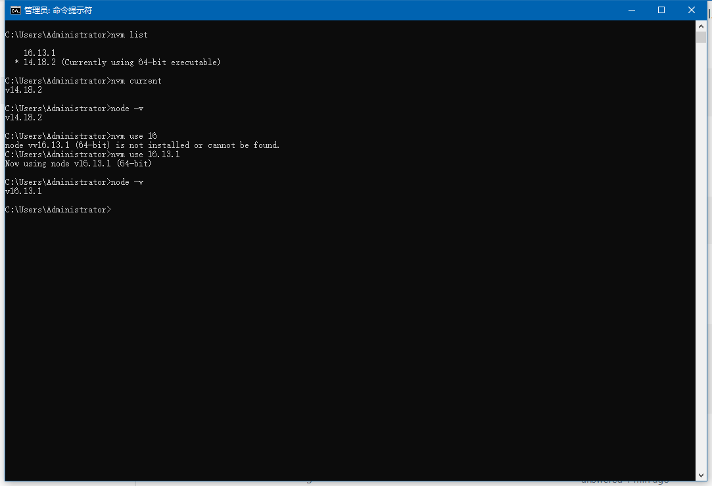

Make sure you delete all old nodejs.

step 1:uninstall nodejs and remove node_home and npm_home;

step 2: download nvm and Install it. My OS is win, so link is : https://github.com/coreybutler/nvm-windows/releases. if your OS is MAC or Linux, you can use `brew` or `apt install` utils to install.

step3: open cmd.exe, run it as "administrator", checking NVM_HOME and NVM_SYMLINK example:

```js
NVM_HOME=D:\dev\node\nvm
NVM_SYMLINK=D:\dev\node\nodejs
```

Note:**make sure nvm home and nvm symlink need in diff forlder**.

if not set , your must set manual and add path:

```js
%NVM_HOME%
%NVM_SYMLINK%
```

open a new cmd.exe terminal, and make sure these is OK.

step 4: Open new terminal prompt:

```js
run 'nvm on'
run 'nvm list'
run 'nvm install 14'
run 'nvm use 14.18.2'
run 'node --version'
```




enjoy it.