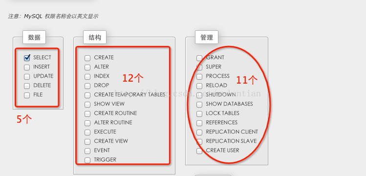

### mysql grant 用户权限总结

```sql
show grants for 'proaim'@'%';

GRANT 
SELECT, 
INSERT, 
UPDATE, 
DELETE, 
CREATE, 
REFERENCES, 
INDEX
ON `trinity_demo`.* TO 'proaim'@'%' IDENTIFIED by 'proaim@2019';
```


#### 用户权限管理主要有以下作用： 
1. 可以限制用户访问哪些库、哪些表 
2. 可以限制用户对哪些表执行SELECT、CREATE、DELETE、DELETE、ALTER等操作 
3. 可以限制用户登录的IP或域名 
4. 可以限制用户自己的权限是否可以授权给别的用户

- 用户授权
```sql
grant all privileges on *.* to 'yangxin'@'%' identified by 'yangxin123456' with grant option;

```

1. all privileges：表示将所有权限授予给用户。也可指定具体的权限，如：SELECT、CREATE、DROP等。
2. on：表示这些权限对哪些数据库和表生效，格式：数据库名.表名，这里写“*”表示所有数据库，所有表。如果我要指定将权限应用到test库的user表中，可以这么写：test.user
3. to：将权限授予哪个用户。格式：”用户名”@”登录IP或域名”。%表示没有限制，在任何主机都可以登录。比如：”yangxin”@”192.168.0.%”，表示yangxin这个用户只能在192.168.0IP段登录
4. identified by：指定用户的登录密码
5. with grant option：表示允许用户将自己的权限授权给其它用户


- 刷新权限
```sql
flush privileges;
```
- 查看用户权限
```sql
grant select,create,drop,update,alter on *.* to 'yangxin'@'localhost' identified by 'yangxin0917' with grant option;
show grants for 'yangxin'@'localhost';
```

- 回收权限
```sql
revoke create on *.* from 'yangxin@localhost';
flush privileges;
```

- 删除用户
```sql
select host,user from user;
drop user 'yangxin'@'localhost';

```

- 用户重命名
```sql
rename user 'test3'@'%' to 'test1'@'%';
```

- 修改密码
```sql
mysqladmin -uroot -p123456 password 1234abcd
```

- 忘记密码
1. 添加登录跳过权限检查配置
修改my.cnf，在mysqld配置节点添加skip-grant-tables配置
```conf

[mysqld]
skip-grant-tables
```

2. service mysqld restart

3. 修改密码

注意：mysql库的user表，5.7以下版本密码字段为password，5.7以上版本密码字段为authentication_string

4. 还原登录权限跳过检查配置
将my.cnf中mysqld节点的skip-grant-tables配置删除，然后重新启动服务即可。

- 28个权限(5个数据权限, 11个结构权限, 12个管理权限)


以下文字TL, DR

一．权限表

mysql数据库中的3个权限表：user 、db、 host

权限表的存取过程是：

1)先从user表中的host、 user、 password这3个字段中判断连接的IP、用户名、密码是否存在表中，存在则通过身份验证；

2)通过权限验证，进行权限分配时，按照useràdbàtables_privàcolumns_priv的顺序进行分配。即先检查全局权限表user，如果user中对应的权限为Y，则此用户对所有数据库的权限都为Y，将不再检查db, tables_priv,columns_priv；如果为N，则到db表中检查此用户对应的具体数据库，并得到db中为Y的权限；如果db中为N，则检查tables_priv中此数据库对应的具体表，取得表中的权限Y，以此类推。

二．MySQL各种权限（共27个）

（以下操作都是以root身份登陆进行grant授权，以p1@localhost身份登陆执行各种命令。）

1. usage

连接（登陆）权限，建立一个用户，就会自动授予其usage权限（默认授予）。

mysql> grant usage on *.* to ‘p1′@’localhost’ identified by ‘123′;

该权限只能用于数据库登陆，不能执行任何操作；且usage权限不能被回收，也即REVOKE用户并不能删除用户。

2. select

必须有select的权限，才可以使用select table

mysql> grant select on pyt.* to ‘p1′@’localhost’;

mysql> select * from shop;

3. create

必须有create的权限，才可以使用create table

mysql> grant create on pyt.* to ‘p1′@’localhost’;

4. create routine

必须具有create routine的权限，才可以使用{create |alter|drop} {procedure|function}

mysql> grant create routine on pyt.* to ‘p1′@’localhost’;

当授予create routine时，自动授予EXECUTE, ALTER ROUTINE权限给它的创建者：

mysql> show grants for ‘p1′@’localhost’;

+—————————————————————————+

Grants for p1@localhost

+————————————————————————–+

| GRANT USAGE ON *.* TO ‘p1′@’localhost’ IDENTIFIED BY PASSWORD ‘*23AE809DDACAF96AF0FD78ED04B6A265E05AA257′ |

| GRANT SELECT, CREATE, CREATE ROUTINE ON `pyt`.* TO ‘p1′@’localhost’|

| GRANT EXECUTE, ALTER ROUTINE ON PROCEDURE `pyt`.`pro_shop1` TO ‘p1′@’localhost’ |

+————————————————————————————-+

5. create temporary tables(注意这里是tables，不是table)

必须有create temporary tables的权限，才可以使用create temporary tables.

mysql> grant create temporary tables on pyt.* to ‘p1′@’localhost’;

[mysql@mydev ~]$ mysql -h localhost -u p1 -p pyt

mysql> create temporary table tt1(id int);

6. create view

必须有create view的权限，才可以使用create view

mysql> grant create view on pyt.* to ‘p1′@’localhost’;

mysql> create view v_shop as select price from shop;

7. create user

要使用CREATE USER，必须拥有mysql数据库的全局CREATE USER权限，或拥有INSERT权限。

mysql> grant create user on *.* to ‘p1′@’localhost’;

或：mysql> grant insert on *.* to p1@localhost;

8. insert

必须有insert的权限，才可以使用insert into ….. values….

9. alter

必须有alter的权限，才可以使用alter table

alter table shop modify dealer char(15);

10. alter routine

必须具有alter routine的权限，才可以使用{alter |drop} {procedure|function}

mysql>grant alter routine on pyt.* to ‘p1′@’ localhost ‘;

mysql> drop procedure pro_shop;

Query OK, 0 rows affected (0.00 sec)

mysql> revoke alter routine on pyt.* from ‘p1′@’localhost’;

[mysql@mydev ~]$ mysql -h localhost -u p1 -p pyt

mysql> drop procedure pro_shop;

ERROR 1370 (42000): alter routine command denied to user ‘p1′@’localhost’ for routine ‘pyt.pro_shop’

11. update

必须有update的权限，才可以使用update table

mysql> update shop set price=3.5 where article=0001 and dealer=’A';

12. delete

必须有delete的权限，才可以使用delete from ….where….(删除表中的记录)

13. drop

必须有drop的权限，才可以使用drop database db_name; drop table tab_name;

drop view vi_name; drop index in_name;

14. show database

通过show database只能看到你拥有的某些权限的数据库，除非你拥有全局SHOW DATABASES权限。

对于p1@localhost用户来说，没有对mysql数据库的权限，所以以此身份登陆查询时，无法看到mysql数据库：

mysql> show databases;

+——————–+

| Database |

+——————–+

| information_schema|

| pyt |

| test |

+——————–+

15. show view

必须拥有show view权限，才能执行show create view。

mysql> grant show view on pyt.* to p1@localhost;

mysql> show create view v_shop;

16. index

必须拥有index权限，才能执行[create |drop] index

mysql> grant index on pyt.* to p1@localhost;

mysql> create index ix_shop on shop(article);

mysql> drop index ix_shop on shop;

17. excute

执行存在的Functions,Procedures

mysql> call pro_shop1(0001,@a)；

+———+

| article |

+———+

| 0001 |

| 0001 |

+———+

mysql> select @a;

+——+

| @a |

+——+

| 2 |

+——+

18. lock tables

必须拥有lock tables权限，才可以使用lock tables

mysql> grant lock tables on pyt.* to p1@localhost;

mysql> lock tables a1 read;

mysql> unlock tables;

19. references

有了REFERENCES权限，用户就可以将其它表的一个字段作为某一个表的外键约束。

20. reload

必须拥有reload权限，才可以执行flush [tables | logs | privileges]

mysql> grant reload on pyt.* to p1@localhost;

ERROR 1221 (HY000): Incorrect usage of DB GRANT and GLOBAL PRIVILEGES

mysql> grant reload on *.* to ‘p1′@’localhost’;

Query OK, 0 rows affected (0.00 sec)

mysql> flush tables;

21. replication client

拥有此权限可以查询master server、slave server状态。

mysql> show master status;

ERROR 1227 (42000): Access denied; you need the SUPER,REPLICATION CLIENT privilege for this operation

mysql> grant Replication client on *.* to p1@localhost;

或：mysql> grant super on *.* to p1@localhost;

mysql> show master status;

+——————+———-+————–+——————+

| File | Position | Binlog_Do_DB | Binlog_Ignore_DB |

+——————+———-+————–+——————+

| mysql-bin.000006 | 2111 | | |

+——————+———-+————–+——————+

mysql> show slave status;

22. replication slave

拥有此权限可以查看从服务器，从主服务器读取二进制日志。

mysql> show slave hosts;

ERROR 1227 (42000): Access denied; you need the REPLICATION SLAVE privilege for this operation

mysql> show binlog events;

ERROR 1227 (42000): Access denied; you need the REPLICATION SLAVE privilege for this operation

mysql> grant replication slave on *.* to p1@localhost;

mysql> show slave hosts;

Empty set (0.00 sec)

mysql>show binlog events;

+—————+——-+—————-+———–+————-+————–+

| Log_name | Pos | Event_type | Server_id| End_log_pos|Info | 

+—————+——-+————–+———–+————-+—————+

| mysql-bin.000005 | 4 | Format_desc | 1 | 98 | Server ver: 5.0.77-log, Binlog ver: 4 | |mysql-bin.000005|98|Query|1|197|use `mysql`; create table a1(i int)engine=myisam|

……………………………………

23. Shutdown

关闭MySQL：

[mysql@mydev ~]$ mysqladmin shutdown

重新连接：

[mysql@mydev ~]$ mysql

ERROR 2002 (HY000): Can’t connect to local MySQL server through socket ‘/tmp/mysql.sock’ (2)

[mysql@mydev ~]$ cd /u01/mysql/bin

[mysql@mydev bin]$ ./mysqld_safe &

[mysql@mydev bin]$ mysql

24. grant option

拥有grant option，就可以将自己拥有的权限授予其他用户（仅限于自己已经拥有的权限）

mysql> grant Grant option on pyt.* to p1@localhost;

mysql> grant select on pyt.* to p2@localhost;

25. file

拥有file权限才可以执行 select ..into outfile和load data infile…操作，但是不要把file, process, super权限授予管理员以外的账号，这样存在严重的安全隐患。

mysql> grant file on *.* to p1@localhost;

mysql> load data infile ‘/home/mysql/pet.txt’ into table pet;

26. super

这个权限允许用户终止任何查询；修改全局变量的SET语句；使用CHANGE MASTER，PURGE MASTER LOGS。

mysql> grant super on *.* to p1@localhost;

mysql> purge master logs before ‘mysql-bin.000006′;

27. process

通过这个权限，用户可以执行SHOW PROCESSLIST和KILL命令。默认情况下，每个用户都可以执行SHOW PROCESSLIST命令，但是只能查询本用户的进程。

mysql> show processlist;

+—-+——+———–+——+———+——+——-+——————+

| Id | User | Host | db | Command | Time | State | Info |

+—-+——+———–+——+———+——+——-+——————+

| 12 | p1 | localhost | pyt | Query | 0 | NULL | show processlist |

+—-+——+———–+——+———+——+——-+——————+

另外，

管理权限（如 super， process， file等）不能够指定某个数据库，on后面必须跟*.*

mysql> grant super on pyt.* to p1@localhost;

ERROR 1221 (HY000): Incorrect usage of DB GRANT and GLOBAL PRIVILEGES

mysql> grant super on *.* to p1@localhost;

Query OK, 0 rows affected (0.01 sec)