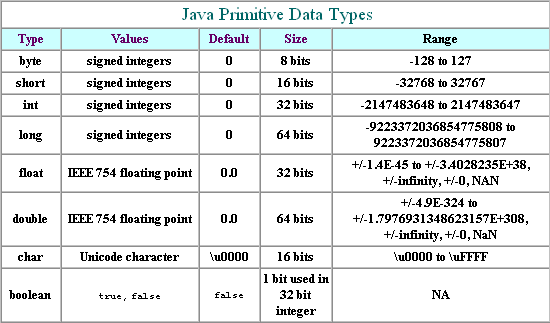

## Java 主数据类型长度和大小

  

- byte类型

特点: 

1. 有符号, 一个字节(8bit)
2. 第一个bit是符号位, 剩余的7bit是值
3. 值的范围: -2^7 ~ 2^7 - 1 (-128 ~ 127)

- char类型

特点: 

1. 无符号, 2个字节(16bit);
2. 前256ASCII码一致
3. 值的范围: 0~2^32(0x0000~0xffff)

