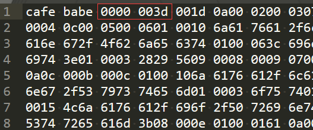

Java 版本号

-   JDK版本和Java类文件的版本对应关系

JDK 17 = 61,
JDK 16 = 60,
JDK 15 = 59,
JDK 14 = 58,
JDK 13 = 57,
JDK 12 = 56,
JDK 11 = 55,
JDK 10 = 54,
JDK 9 = 53,
JDK 8 = 52,
JDK 7 = 51,
JDK 6.0 = 50,
JDK 5.0 = 49,
JDK 1.4 = 48,
JDK 1.3 = 47,
JDK 1.2 = 46,
JDK 1.1 = 45.0-45.6

-   在已经编译好的class文件查看和确定编译的JDK的版本号

使用文本编辑器（sublime text）打开class文件

用十六进制表示的，在一串魔法数（cafe babe）之后，就是版本号。
前面两位是次版本号，后面两位是主版本号。

上面的“00” 就是次版本号，转换为十进制是0
上面的“3d”就是主版本号，转换为十进制是61

所以使用的JDK是JDK 17。

各个版本的对应关系

JDK版本号	Class版本号	16进制
1.1	45.0	00 00 00 2D
1.2	46.0	00 00 00 2E
1.3	47.0	00 00 00 2F
1.4	48.0	00 00 00 30
1.5	49.0	00 00 00 31
1.6	50.0	00 00 00 32
1.7	51.0	00 00 00 33
1.8	52.0	00 00 00 34