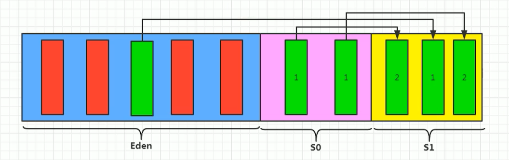
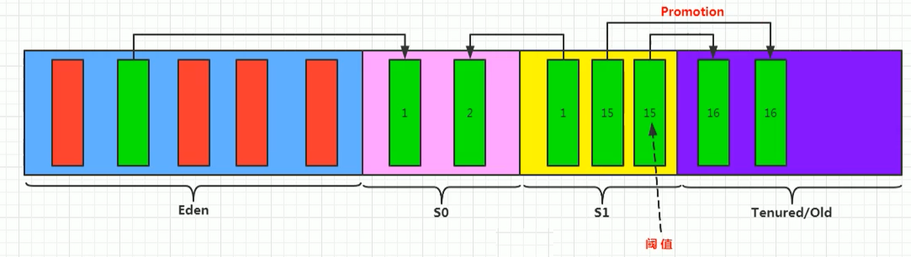
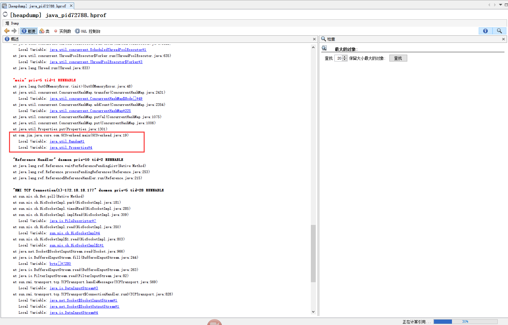
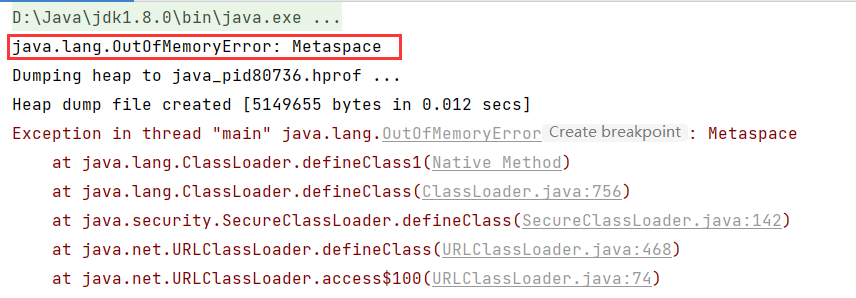

# JVM体系结构

参考链接：

[JVM]: https://www.cnblogs.com/ruoli-0/p/13882894.html

 JAVA是一门跨平台的语言，这跟他的虚拟机有关。 JVM是运行在操作系统之上的，它与硬件没有直接的交互，而是依赖不同操作系统的java虚拟机。


## JVM的体系结构


-   类加载器 ：负责加载class文件，并且ClassLoader只负责class文件的加载，至于它是否可以运行，则由ExecutionEngine决定。 

     JVM自带的加载器有:

    -   启动类加载器（Bootstrap classloader）
    -   扩展类加载器（Extension classloader）
    -   应用程序加载器（Application classloader）

    另外，用户也可以自定义类加载器，类的加载遵循双亲委派的模式。

    

```java
//自定义class loader，扩展ClassLoader
public class MyCustomizeClassLoader extends ClassLoader {
	public Class<?> findClass(String className) throws ClassNotFoundException {
		byte[] classData = loadClassData(className);
		if (classData == null) return null;
		return defineClass(className, classData, 0, classData.length);
	}

	private byte[] loadClassData(String className) {
		try (InputStream inputStream = getClass().getClassLoader().getResourceAsStream(className.replace(".", "/") + ".class");
			 ByteArrayOutputStream byteArrayOutputStream = new ByteArrayOutputStream()) {
			int len;
			if (inputStream == null) return null;
			while ((len = inputStream.read()) != -1) {
				byteArrayOutputStream.write(len);
			}

			return byteArrayOutputStream.toByteArray();
		} catch (IOException e) {
			e.printStackTrace();
			return null;
		}
	}
}

//待加载的类
public class A {
    public static void main(String[] args) {
        final long N = 5_000_000_000L;
        int C = 0; 

        for(int i = 1; i < N; i++) { 
            double x = Math.random(); 
            double y = Math.random(); 
            if((x * x + y * y) <= 1) 
                C++; 
        } 

        System.out.println("PI = " + (double) 4 * C / N);  
    }

    public static void show() {
        System.out.println("show");
    }

    private void show2() {
        System.out.println("show");
    }
}
```


-    本地方法接口 （Native interface）

    Java语言本身不能对操作系统底层就像访问和操作，但是可以通过Native Interface接口调用其他语言来实现对底层的访问。即：在内存中开辟一块内存（Native Method Stack）登记Native方法，专门处理和标记Native的代码，在调用本地方法时，在执行引擎加载并执行。

-    执行引擎 

    负责字节码的解释，讲字节码编译成机器语言并执行。

-    运行时数据区 

    包括：共享区（Metaspace，堆）和线程独占区（虚拟机栈，本地方法栈和程序计数器）

    ### `Metaspace`

    [https://www.javadoop.com/post/metaspace]: 参考
    
    
    
    #### 特点
    
    -   与类加载器的生命周期相同；
        
    -   大小与应用加载了多少个类有关；
    
    -   Metaspace在堆之外，主要用来存储：
    
        -   类的结构
        -   方法的元数据：包括方法的字节码，局部变量表，异常表，参数信息等；
        -   常量池
    
    -   注解
        -   方法计数器：记录方法被执行的次数，用来辅助JIT决策等信息；
    
        虽然每个java类都关联了一个java.lang.Class的实例，而且他是一个贮存在堆中的java对象。但是类的元数据不是java对象，所以放在Metaspace中。
    
        
    
        #### 什么时候分配Metaspace空间
    
        当一个类被类加载器加载的时候，它的类加载器会负责在Metasapce中申请和分配这个类的元数据；
    
        
    
        #### 什么时候回收Metaspace空间
    
        -   为一个类分配metadata是这个类的类加载器负责的，所以只有当类加载器卸载时，这个空间才会卸载释放。
    
        所以，只有当这个类加载的类都没有存活对象并且没有这些类和类加载器的引用时，相应的metaspace空间才会被GC释放。
    
        
    
    与Metaspace相关的参数：
    
    -   -XX:MetaspaceSize=xxM
    
        Metaspace的初始空间。
    
    -   -XX:MaxMetaspaceSize=xxM
    
        Metaspace的最大空间，默认是不限制。
    
    #### Metaspace和GC
    
    -   Metaspace 可能在两种情况下触发 GC：
    
        -   分配空间时：虚拟机维护了一个阈值，如果 Metaspace 的空间大小超过了这个阈值，那么在新的空间分配申请时，虚拟机首先会通过收集可以卸载的类加载器来达到复用空间的目的，而不是扩大 Metaspace 的空间，这个时候会触发 GC。这个阈值会上下调整，和 Metaspace 已经占用的操作系统内存保持一个距离。
    
        -   碰到 Metaspace OOM：Metaspace 的总使用空间达到了 MaxMetaspaceSize 设置的阈值，或者 Compressed Class Space 被使用光了，如果这次 GC 真的通过卸载类加载器腾出了很多的空间，这很好，否则的话，我们会进入一个糟糕的 GC 周期，即使我们有足够的堆内存。
    
    
    
    ### `堆`
    
    #### 堆的特点
    
    -    一个JVM实例只存在一个堆内存，堆内存的大小是可以调节的；
    -     Java 堆是被所有线程共享的一块内存区域，在虚拟机启动时创建。这个区域是用来存放对象实例的，几乎所有对象实例都会在这里分配内存。
    
    #### 堆的内存结构
    
    -   堆的内存结构由新生代，老年代组成；
    -   新生代又由伊甸园（Eden）和幸存区（Survivor， s0, s1）组成；
    
    #### 堆的生命周期
    
    -   新生代：是对象诞生，成长，消亡的区域。一个对象在这里产生，应用，最后被垃圾回收器收集，销毁。新生代又分为两部分： 伊甸区（Eden space）和幸存者区（Survivor pace） ，所有的对象都是在伊甸区被new出来的。幸存区有两个： 0区（Survivor 0 space）和1区（Survivor 1 space）。当伊甸园的空间用完时，程序又需要创建对象，JVM的垃圾回收器将对伊甸园区进行垃圾回收(Minor GC)，将伊甸园区中的不再被其他对象所引用的对象进行销毁。然后将伊甸园中的剩余对象移动到幸存0区.若幸存0区也满了，再对该区进行垃圾回收，然后移动到1区。那如果1区也满了呢？再移动到老年代。
    -    老年代：若老年代也满了，那么这个时候将产生MajorGC（FullGC），进行老年代的内存清理。若老年代执行了Full GC之后发现依然无法进行对象的保存，就会产生OOM异常“OutOfMemoryError”。 
	
	#### 垃圾回收
	
    -     根据发生的区域来分类:
    	- Minor GC：从年轻代空间（包括 Eden 和 Survivor 区域）回收内存被称为 Minor GC。
    	- Major GC ：是清理老年代。
    	- Full GC（Minor GC+Major GC） ：是清理整个堆空间—包括年轻代和老年代。 
    
    #### 回收算法
    
    -    ***标记-清除算法***  先标记可回收的内存，后清除，缺点是：效率比较低；会出现大量不连续的内存碎片。 
    -    ***复制算法***：将可用的内存分成两份，每次使用其中一块，当这块回收之后把未回收的复制到另一块内存中，然后把使用的清除。 
    -    ***标记整理算法***：是在标记-清除算法基础上，不直接清理，而是使存活对象往一端游走，然后清除一端边界以外的内存，这样既可以避免不连续空间出现，还可以避免对象存活率较高时的持续复制。 
    -   分代收集算法：分代收集算法就是目前虚拟机使用的回收算法，它解决了标记整理不适用于老年代的问题，将内存分为各个年代，在不同年代使用不同的算法，从而使用最合适的算法，新生代存活率低，可以使用复制算法。而老年代对象存活率高，没有额外空间对它进行分配担保，所以只能使用标记清除或者标记整理算法。
    
    #### 垃圾收集器
    
    -   Serial收集器：新生代串行收集器，采用“复制”算法，适合单核处理器，在垃圾回收时，必须暂停其他所有线程。
    
    -   Serial Old收集器：老年代串行收集器，采用“标记-整理”算法，可与Serial收集器协同工作
    
    -   ParNew收集器：Serial收集器的多线程版本，并行收集器，除了使用多条线程进行垃圾回收之外，其他与Serial一样，即也需要停止所有用户线程，采用复制算法等。
    
    -   Parallel Scavenge：新生代垃圾并行收集器，并行的复制算法收集器，特点：可控制吞吐量，运行时暂停所有线程
    
    -   Parallel Old：Parallel Scavenge的老年代版本并行收集器，只能和Parallel Scavenge配合使用，使用“标记-整理”算法。
    
    -   Concurrent Mark Sweep（CMS）：并发垃圾收集器，且采用标记-清除算法。
    
	-   Garbage-First收集器（G1）：G1既可以作用于新生代又可以作用于老年代。
    
        
    
    #### 垃圾收集器默认情况：
          jdk1.7 默认垃圾收集器Parallel Scavenge（新生代）+Parallel Old（老年代）
          jdk1.8 默认垃圾收集器Parallel Scavenge（新生代）+Parallel Old（老年代）
          jdk1.9 默认垃圾收集器G1
    


### 内存分配过程

为新对象分配内存是一件非常严谨和复杂的任务，JVM的设计者们不仅需要考虑内存如何分配、在哪里分配等问题，并且由于内存分配算法与内存回收算法密切相关，所以还需要考虑GC执行完内存回收后是否会在内存空间中产生内存碎片。

　　➷ new的对象先放伊甸园区，此区有大小限制。

　　➷ 当伊甸园的空间填满时，程序又需要创建对象，JVM的垃圾回收器将对伊甸园区进行垃圾回收（MinorGC），将伊甸园区中的不再被其他对象所引用的对象进行销毁，然后将伊甸园中的剩余对象移动到幸存者0区（或者1区，不确定），再加载新的对象放到伊甸园区。

　　➷ 如果再次触发垃圾回收，此时上次幸存下来的放到幸存者0区的对象，如果没有被回收，将会和本次伊甸园区中幸存下来的对象一起放到幸存者1区。

　　➷ 如果再次经历垃圾回收，此时会将两个有对象的区中幸存下来的对象重新放回幸存者0区。

　　➷ 之后，再放到幸存者1区，循环往复。

　　➷ 啥时候能去养老区呢？可以设置次数，默认是15次。可以通过设置参数：-XX:MaxTenuringThreshold= N 进行最大年龄的设置。

　　➷ 在养老区，相对悠闲。当养老区内存不足时，再次触发GC：Major GC，进行养老区的内存清理。

　　➷ 若养老区执行了Major GC之后，发现依然无法进行对象的保存，就会产生OOM异常。

GC运行，伊甸园的幸存者复制到survior


GC运行，复制幸存者到s0/s1，晋级老对象


晋级老对象到养老区



具体判断流程


### hotspot JVM 参数列表

##### HotSpot GC collectors

HotSpot JVM may use one of 6 combinations of garbage collection algorithms listed below.

| **Young collector**            | **Old collector**                       | **JVM option**                            |
| ------------------------------ | --------------------------------------- | ----------------------------------------- |
| Serial (DefNew)                | Serial Mark-Sweep-Compact               | `-XX:+UseSerialGC`                        |
| Parallel scavenge (PSYoungGen) | Serial Mark-Sweep-Compact (PSOldGen)    | `-XX:+UseParallelGC`                      |
| Parallel scavenge (PSYoungGen) | Parallel Mark-Sweep-Compact (ParOldGen) | `-XX:+UseParallelOldGC`                   |
| Serial (DefNew)                | Concurrent Mark Sweep                   | `-XX:+UseConcMarkSweepGC-XX:-UseParNewGC` |
| Parallel (ParNew)              | Concurrent Mark Sweep                   | `-XX:+UseConcMarkSweepGC-XX:+UseParNewGC` |
| G1                             | `-XX:+UseG1GC`                          |                                           |

##### GC logging options

Please note that many of logging options could be modified on running JVM using JMX (e.g. via JConsole).

| **JVM option**                         | **Description**                                              |
| -------------------------------------- | ------------------------------------------------------------ |
| General options                        |                                                              |
| -verbose:gc or -XX:+PrintGC            | Print basic GC info                                          |
| -XX:+PrintGCDetails                    | Print more elaborated GC info                                |
| -XX:+PrintGCTimeStamps                 | Print timestamps for each GC event (seconds count from start of JVM) |
| -XX:+PrintGCDateStamps                 | Print date stamps at garbage collection events (e.g. 2011-09-08T14:20:29.557+0400: [GC... ) |
| -XX:+PrintGC\TaskTimeStamps            | Print timestamps for individual GC worker thread tasks (very verbose) |
| -Xloggc:                               | Redirects GC output to a file instead of console             |
| -XX:+Print\TenuringDistribution        | Print detailed demography of young space after each collection |
| -XX:+PrintTLAB                         | Print TLAB allocation statistics                             |
| -XX:+PrintReferenceGC                  | Print times for weak/soft/JNI/etc reference processing during STW pause |
| -XX:+PrintJNIGCStalls                  | Reports if GC is waiting for native code to unpin object in memory |
| -XX:+PrintGC\ApplicationStoppedTime    | Print pause summary after each stop-the-world pause          |
| -XX:+PrintGC\ApplicationConcurrentTime | Print time for each concurrent phase of GC                   |
| -XX:+Print\ClassHistogramAfterFullGC   | Prints class histogram after full GC                         |
| -XX:+Print\ClassHistogramBeforeFullGC  | Prints class histogram before full GC                        |
| -XX:+HeapDump\AfterFullGC              | Creates heap dump file after full GC                         |
| -XX:+HeapDump\BeforeFullGC             | Creates heap dump file before full GC                        |
| -XX:+HeapDump\OnOutOfMemoryError       | Creates heap dump in out-of-memory condition                 |
| -XX:HeapDumpPath=<path>                | Specifies path to save heap dumps                            |
| CMS specific options                   |                                                              |
| `-XX:PrintCMSStatistics=2`             | Print additional CMS statistics if n >= 1                    |
| `-XX:+Print\``CMSInitiationStatistics` | Print CMS initiation details                                 |
| `-XX:PrintFLSStatistics=2`             | Print additional info concerning free lists                  |
| `-XX:PrintFLSCensus=2`                 | Print additional info concerning free lists                  |
| `-XX:+PrintPromotionFailure`           | Print additional diagnostic information following promotion failure |
| `-XX:+CMSDumpAt\``PromotionFailure`    | Dump useful information about the state of the CMS old generation upon a promotion failure. |
| `-XX:+CMSPrint\``ChunksInDump`         | In a CMS dump enabled by option above, include more detailed information about the free chunks. |
| `-XX:+CMSPrint\``ObjectsInDump`        | In a CMS dump enabled by option above, include more detailed information about the allocated objects. |

# JVM sizing options

| **JVM option**                                               | **Description**                                              |
| ------------------------------------------------------------ | ------------------------------------------------------------ |
| -Xms2048m -Xmx2g or‑XX:InitialHeapSize=2g ‑XX:MaxHeapSize=2g | Initial and max size of heap space (young space + tenured space). Permanent space does not count to this size. |
| -XX:NewSize=64m-XX:MaxNewSize=64m                            | Initial and max size of young space.                         |
| -XX:NewRatio=3                                               | Alternative way to specify young space size. Sets ration of young vs tenured space (e.g. -XX:NewRatio=2 means that young space will be 2 time smaller than tenuted space). |
| `-XX:SurvivorRatio=15`                                       | Sets size of single survivor space as a portion of Eden space size (e.g. -XX:NewSize=64m -XX:SurvivorRatio=6 means that each survivor space will be 8m and eden will be 48m). |
| `-XX:PermSize=256m``-XX:MaxPermSize=256m`                    | Initial and max size of permanent space.                     |
| `-Xss256k` (size in bytes) or ` ``-XX:ThreadStackSize=256 (size in Kbytes)` | Sets size of stack area dedicated to each thread. Thread stacks do not count to heap size. |
| `-XX:MaxDirectMemorySize=2g`                                 | Maximum size of off-heap memory available for JVM            |

# Young collection tuning

| **JVM option**                  | **Description**                                              |
| ------------------------------- | ------------------------------------------------------------ |
| -XX:Initial\TenuringThreshold=8 | Initial value for tenuring threshold (number of collections before object will be promoted to tenured space). |
| -XX:Max\TenuringThreshold=15    | Max value for tenuring threshold.                            |
| -XX:Pretenure\SizeThreshold=2m  | Max object size allowed to be allocated in young space (large objects will be allocated directly in old space). Thread local allocation bypasses this check so if TLAB is large enough object exciding size threshold still may be allocated in young. |
| -XX:+AlwaysTenure               | Promote all objects surviving young collection immediately to tenured space (equivalent of -XX:MaxTenuringThreshold=0) |
| -XX:+NeverTenure                | Objects from young space will never get promoted to tenured space while survivor space is large enough to keep them. |
| Thread local allocation blocks  |                                                              |
| -XX:+UseTLAB                    | Use thread local allocation blocks in young space. Enabled by default. |
| -XX:+ResizeTLAB                 | Allow JVM to adaptively resize TLAB for threads.             |
| -XX:TLABSize=1m                 | Initial size of TLAB for thread                              |
| -XX:MinTLABSize=64k             | Minimal allowed size of TLAB                                 |

# CMS tuning options

| **JVM option**                                     | **Description**                                              |
| -------------------------------------------------- | ------------------------------------------------------------ |
| Controlling initial mark phase                     |                                                              |
| -XX:+UseCMSInitiating\OccupancyOnly                | Only use occupancy as a criterion for starting a CMS collection. |
| -XX:CMSInitiating\OccupancyFraction=70             | Percentage CMS generation occupancy to start a CMS collection cycle. A negative value means that CMSTriggerRatio is used. |
| -XX:CMSBootstrap\Occupancy=10                      | Percentage CMS generation occupancy at which to initiate CMS collection for bootstrapping collection stats. |
| -XX:CMSTriggerRatio=70                             | Percentage of MinHeapFreeRatio in CMS generation that is allocated before a CMS collection cycle commences. |
| -XX:CMSTriggerPermRatio=90                         | Percentage of MinHeapFreeRatio in the CMS perm generation that is allocated before a CMS collection cycle commences, that also collects the perm generation. |
| -XX:CMSWaitDuration=2000                           | Once CMS collection is triggered, it will wait for next young collection to perform initial mark right after. This parameter specifies how long CMS can wait for young collection. |
| Controlling remark phase                           |                                                              |
| -XX:+CMSParallel\RemarkEnabled                     | Whether parallel remark enabled (only if ParNewGC), enabled by default |
| -XX:+CMSParallel\SurvivorRemarkEnabled             | Whether parallel remark of survivor space enabled (effective only with option above), enabled by default |
| -XX:+CMSScavengeBeforeRemark                       | Force young collection before remark phase.                  |
| -XX:+CMSScheduleRemark\EdenSizeThreshold           | If Eden used is below this value, don't try to schedule remark |
| -XX:CMSScheduleRemark\EdenPenetration=20           | The Eden occupancy % at which to try and schedule remark pause |
| -XX:CMSScheduleRemark\SamplingRatio=4              | Start sampling Eden top at least before young generation occupancy reaches 1/ of the size at which we plan to schedule remark |
| -XX:CMSRemarkVerifyVariant=1                       | Choose variant (1,2) of verification following remark        |
| Parallel execution                                 |                                                              |
| -XX:+UseParNewGC                                   | Use parallel algorithm for young space collection.           |
| -XX:+CMSConcurrentMTEnabled                        | Use multiple threads for concurrent phases.                  |
| -XX:ConcGCThreads=2                                | Number of parallel threads used for concurrent phase.        |
| -XX:ParallelGCThreads=2                            | Number of parallel threads used for stop-the-world phases.   |
| CMS incremental mode                               |                                                              |
| -XX:+CMSIncrementalMode                            | Enable incremental CMS mode. Incremental mode is meant for severs with small number of CPU. Do not use it on modern hardware. |
| Miscellaneous options                              |                                                              |
| -XX:+CMSClassUnloadingEnabled                      | If not enabled, CMS will not clean permanent space. You should always enable it in multiple class loader environments such as JEE or OSGi. |
| -XX:+ExplicitGCInvokes\Concurrent                  | Let System.gc() trigger concurrent collection instead of full GC. |
| ‑XX:+ExplicitGCInvokes\ConcurrentAndUnloadsClasses | Same as above but also triggers permanent space collection.  |

# Miscellaneous GC options

| **JVM option**                    | **Description**                                              |
| --------------------------------- | ------------------------------------------------------------ |
| -XX:+DisableExplicitGC            | JVM will ignore application calls to System.gc()             |
| -XX:SoftRefLRU\PolicyMSPerMB=1000 | Soft references time to live in milliseconds per MB of free space in the heap |
| OutOfMemoryError conditions       |                                                              |
| -XX:+UseGCOverheadLimit           | Use policy to limit of proportion of time spent in GC before an OutOfMemory error is thrown |
| -XX:GCTimeLimit=98                | Limit of proportion of time spent in GC before an OutOfMemory error is thrown (used with GCHeapFreeLimit) |
| -XX:GCHeapFreeLimit=2             | Minimum percentage of free space after a full GC before an OutOfMemoryError is thrown (used with GCTimeLimit) |

# G1 (garbage first) GC options

G1 is still evolving, so table below have known supported JVM version column

| **JVM option**                | **JVM** | **Description**                                              |
| ----------------------------- | ------- | ------------------------------------------------------------ |
| -XX:G1HeapRegionSize=8m       | 6u26    | Size of heap region for G1 collector. Region size could be from 1MiB to 32MiB. Default is initial heap size / 2048. |
| -XX:G1ConfidencePercent=50    | 6u26    | Confidence coefficient for G1 pause prediction heuristics    |
| -XX:G1ReservePercent=10       | 6u26    | It determines the minimum reserve we should have in the heap to minimize the probability of promotion failure |
| -XX:MaxGCPauseMillis=200      | 6u26    | GC time per MMU time slice in milliseconds (for G1 only)     |
| -XX:GCPauseIntervalMillis=300 | 6u26    | Time slice for MMU specification in milliseconds (for G1 only). Should be greater than parameter above. |

### 优化参数

-   堆配置：
    -Xms:初始堆大小
    -Xms：最大堆大小

    -Xss: 每个线程的堆栈大小
-XX:NewSize=n:设置年轻代大小
    -XX:NewRatio=n:设置年轻代和年老代的比值。
    -XX:SurvivorRatio=n:年轻代中Eden区与两个Survivor区的比值。
    -XX:MaxMetaSpaceSize=n:最大元空间大小
    
     -XX:MaxTenuringThreshold：设置新生代垃圾的最大年龄。 
    
    -XX:+CollectGen0First : FullGC时是否先YGC


-   收集器设置:
    -XX:+UseSerialGC:设置串行收集器
    -XX:+UseParallelGC:设置并行收集器
    -XX:+UseParalledlOldGC:设置并行年老代收集器
    -XX:+UseConcMarkSweepGC:设置并发收集器
    -XX:ParallelGCThreads 并行收集器的线程数
-   打印GC：
    -XX:+PrintGC
    -XX:+PrintGCDetails
    -XX:+PrintGCTimeStamps
    -Xloggc:filename 


### 关于YGC，FGC

新生代的GC是经常性的，而且采用复制算法，这样可以避免内存碎片的发生。

当年轻代空间不足时，就会触发MinorGC，这里的年轻代满指的是Eden代满，Survivor满不会引发GC。（每次Minor GC会清理年轻代的内存。）

-   因为Java对象大多都具备『**朝生夕灭』**的特性，所以Minor GC非常频繁，一般回收速度也比较快。

-   Minor GC会引发STW：暂停其它用户的线程，等垃圾回收结束，用户线程才恢复运行。

Full GC：指发生在老年代的GC，对象从老年代消失时，我们说 “Major Gc” 或 “Full GC” 发生了。

-   出现了Major GC，经常会伴随至少一次的Minor GC（但非绝对的，在Paralle1 Scavenge收集器的收集策略里就有直接进行Major GC的策略选择过程）。

-   也就是在老年代空间不足时，会先尝试触发Minor GC，如果之后空间还不足，则触发Major GC。

-   Major GC的速度一般会比MinorGc慢10倍以上，STW的时间更长，如果Major GC后，内存还不足，就报OOM了。

### 常见的JVM异常

-    **OutOfMemory(OOM)** 

OutOfMemory ，即内存溢出，是一个常见的 JVM 问题。什么情况下会抛出OOM呢？

有三种 OutOfMemoryError：

OutOfMemoryError:Java heap space - 堆空间溢出
OutOfMemoryError:PermGen space - 方法区和运行时常量池溢出

OutOfMemoryError:GC overhead limit exceed 垃圾回收时间占应用运行98%以上的时间

OutOfMemoryError:unable to create new native thread - 线程无法创建

举例：

[参考举例]: https://www.geeksforgeeks.org/understanding-outofmemoryerror-exception-java/

`Exception in thread "main" java.lang.OutOfMemoryError: Java heap space`

引发的原因可能是：

1.  滥用finalize方法（finalize方法在对象被gc回收之前运行，用来手动释放服务器资源）；
2.  堆内存配置错误（-Xmx）。


解决方法：

1.  使用-Xmx参数，调大堆内存
2.  使用诊断工具，从代码层面减小内存泄漏。

#### 诊断

##### 查看java堆的使用情况

```shell
1.  C:\Users\Administrator>jmap -heap <pid> 或者 jhsdb jmap --pid 26076 --heap
    Attaching to process ID 26076, please wait...
    Debugger attached successfully.
    Server compiler detected.
    JVM version is 17+35-LTS-2724

using thread-local object allocation.
Garbage-First (G1) GC with 23 thread(s)

Heap Configuration:
   MinHeapFreeRatio         = 40 //对应jvm启动参数-XX:MinHeapFreeRatio设置JVM堆最小空闲比率(default 40)
   MaxHeapFreeRatio         = 70 //对应jvm启动参数 -XX:MaxHeapFreeRatio设置JVM堆最大空闲比率(default 70)
   MaxHeapSize              = 20971520 (20.0MB) //对应jvm启动参数-XX:MaxHeapSize=设置JVM堆的最大大小
   NewSize                  = 94371840 (90.0MB) //对应jvm启动参数-XX:NewSize=设置JVM堆的‘新生代’的默认大小
   MaxNewSize               = 94371840 (90.0MB) //对应jvm启动参数-XX:MaxNewSize=设置JVM堆的‘新生代’的最大大小
   OldSize                  = 5452592 (5.1999969482421875MB) //对应jvm启动参数-XX:OldSize=<value>:设置JVM堆的‘老生代’的大小
   NewRatio                 = 2 //对应jvm启动参数-XX:NewRatio=:‘新生代’和‘老生代’的大小比率，2表示新生代:老年代=1:2，新生代占1/3=6.6667，老年代2/3=13.3333
   SurvivorRatio            = 8 //对应jvm启动参数-XX:SurvivorRatio=设置年轻代中Eden区与Survivor区的大小比值，8表示2个Survivor:eden=2:8，即一个survivor占新生代的的1/10=0.6667，两个survivor为1.3，eden占新生代8/10=5.4
   MetaspaceSize            = 10485760 (10.0MB) //对应jvm启动参数-XX:MetaspaceSize，元空间（永生代）的大小
   CompressedClassSpaceSize = 8388608 (8.0MB) 
   MaxMetaspaceSize         = 10485760 (10.0MB)
   G1HeapRegionSize         = 1048576 (1.0MB)

Heap Usage:
G1 Heap:
   regions  = 20
   capacity = 20971520 (20.0MB)
   used     = 12582912 (12.0MB)
   free     = 8388608 (8.0MB)
   60.0% used
G1 Young Generation:
Eden Space:
   regions  = 8
   capacity = 16777216 (16.0MB)
   used     = 8388608 (8.0MB)
   free     = 8388608 (8.0MB)
   50.0% used
Survivor Space:
   regions  = 4
   capacity = 4194304 (4.0MB)
   used     = 4194304 (4.0MB)
   free     = 0 (0.0MB)
   100.0% used
G1 Old Generation:
   regions  = 0
   capacity = 0 (0.0MB)
   used     = 0 (0.0MB)
   free     = 0 (0.0MB)
   0.0% used


C:\Users\Administrator>
```


##### 查看堆内存的对象数量及大小

```shell
C:\Users\Administrator>jmap -histo 26076

num     #instances         #bytes  class name (module)

   1:       2814225      103457288  [Ljava.lang.Object; (java.base@17)
   2:        934926       93958704  [B (java.base@17)
   3:       1720827       68833080  java.util.TreeMap$Entry (java.base@17)
   4:       1327552       42481664  java.io.ObjectStreamClass$WeakClassKey (java.base@17)
   5:        127878       37812264  [C (java.base@17)
   6:        149269       27665672  [I (java.base@17)
   7:        107077       12849240  java.io.ObjectStreamClass (java.base@17)
   8:        349653       11188896  java.util.TreeMap$KeyIterator (java.base@17)
   9:        373540        8964960  java.lang.String (java.base@17)
  10:        156817        7527216  java.util.TreeMap (java.base@17)
  11:         68323        7105592  java.lang.management.ThreadInfo (java.management@17)
  12:        188918        6045376  java.util.TreeMap$EntryIterator (java.base@17)
  13:        217858        5228592  java.io.SerialCallbackContext (java.base@17)
  14:        106017        5088816  java.util.HashMap (java.base@17)
  15:        209040        4052160  [Ljavax.management.openmbean.CompositeData; (java.management@17)
  16:        164110        3938640  java.lang.Long (java.base@17)
```


##### 导出堆内存为文件或者配置自动导出堆内存，用MAT或者Visual VM分析

1.  手动导出

找到运行出错的应用的PID
```shell
C:\Users\Administrator>jps -v
```

手动导出heap文件
```shell
C:\Users\Administrator>jmap -dump:live,format=b,file=heap.bin 26076
Dumping heap to C:\Users\Administrator\heap.bin ...
Unable to create C:\Users\Administrator\heap.bin: File exists
```

2.  在应用启动或者运行时，添加-XX:+HeapDumpOnOutOfMemoryError自动导出Heap文件

	- 添加运行参数
    ```shell
    -XX:+HeapDumpOnOutOfMemoryError
    ```
	- 重新启动应用，收集自动生成的hrop文件
	- 导入Visual VM中分析

```java
import java.util.ArrayList;
import java.util.List;
import java.util.concurrent.TimeUnit;

public class OOMExample {
    static class OOMObject {
        private String name;
        private Long id;
        private int[] body = new int[1000];
    }

    private static int count = 0;

    public static void main(String[] args) {

        try {
            TimeUnit.SECONDS.sleep(20);
        } catch (InterruptedException e) {
            e.printStackTrace();
        }

        List<OOMObject> list = new ArrayList<>();
        while (true) {
            list.add(new OOMObject());
            count++;
            try {
                System.out.println("count:" + count + ", list size:" + list.size());
                Thread.sleep(5);
            } catch (InterruptedException e) {
                e.printStackTrace();
            }
        }
    }
}
```


```shell
-Xms20m //堆的起始大小20MB
-Xmx20m //堆的最大大小20MB
-XX:NewRatio=3 //新生代和老年代的比率1:3，新生代为1/4=5MB，老年代为3/4=15MB
-XX:SurvivorRatio=5 //2个幸存区和伊甸园Eden的比值2:5，伊甸园占5/7=5*5/7=3.57MB。幸存区大小为1.43MB。两个幸存区大小分别是：(5-3.57) /2=0.715MB
-XX:MaxTenuringThreshold=3 //年轻代3次垃圾回收后仍然存活的放到养老院
-XX:MetaspaceSize=4m //元空间的大小4MB
-XX:MaxMetaspaceSize=4m //元空间的最大大小4MB
-XX:MaxGCPauseMillis=100 //GC期间，最大的暂停时间为100毫秒
-XX:+UseG1GC //使用G1垃圾回收器
-XX:G1ReservePercent=20
-XX:+HeapDumpOnOutOfMemoryError //如果发生OOM，自动将堆的内存存为静态文件，方便分析
```


```shell
javac com/jim/java/core/oom/OOMExample.java
java -Xms20m -Xmx20m -XX:NewRatio=3 -XX:SurvivorRatio=5 -XX:MaxTenuringThreshold=3 -XX:MetaspaceSize=4m -XX:MaxMetaspaceSize=4m  -XX:MaxGCPauseMillis=100 -XX:+UseG1GC -XX:G1ReservePercent=20 -XX:+HeapDumpOnOutOfMemoryError com.jim.java.core.oom.OOMExample
```


`Exception: java.lang.OutOfMemoryError thrown from the UncaughtExceptionHandler in thread "main"`

```java
public class GCOverhead {
    public static void main(String args[]) throws Exception {
        try {
            TimeUnit.SECONDS.sleep(20);
        } catch (InterruptedException e) {
            e.printStackTrace();
        }
        Map m = new HashMap();
        m = System.getProperties();
        Random r = new Random();
        while (true) {
            m.put(r.nextInt(), "randomValue");
        }
    }
}

```

这种错误表示GC一直在满负荷运行，而java程序运行非常缓慢。GC在整个运行过程中占98%以上的时间，经过GC后恢复小于2%的堆内存，如果这种发生了5次，那么就会抛出一个OOM，原因就会说无法装载新对象了，GC执行超过时限。

```shell
java -Xmx100m -XX:+UseParallelGC -XX:+HeapDumpOnOutOfMemoryError com.jim.java.core.oom.GCOverhead
java.lang.OutOfMemoryError: Java heap space
Dumping heap to java_pid72788.hprof ...
Heap dump file created [151970925 bytes in 0.596 secs]
Exception in thread "main"
Exception: java.lang.OutOfMemoryError thrown from the UncaughtExceptionHandler in thread "main" GC Overhead limit exceeded
```



```java
public class OOMMetaspace {
    static ClassPool classPool = ClassPool.getDefault();
    //D:\dev\.m2\repository\org\javassist\javassist\3.27.0-GA\javassist-3.27.0-GA.jar
    public static void main(String args[]) throws Exception {
        try {
            TimeUnit.SECONDS.sleep(20);
        } catch (InterruptedException e) {
            e.printStackTrace();
        }
        for (int i = 0; i < 1000000000; i++) {
            Class c = classPool.makeClass("com.jim.java.core.oom" + i).toClass();
                    System.out.println(c.getName());
        }
    }
}
```



Java加载类以后，会在元空间申请内存。如果metaspace内存耗尽，就会抛出OOM。

```shell
-XX:+HeapDumpOnOutOfMemoryError
-XX:MaxMetaspaceSize=10M
```


`Exception in thread "main" java.lang.OutOfMemoryError: Requested array size exceeds VM limit`


```java
public class OOMArraySize {
    public static void main(String args[]) throws Exception {
        System.out.println(Integer.MAX_VALUE);
        Integer[] array = new Integer[Integer.MAX_VALUE];
    }
}
```

