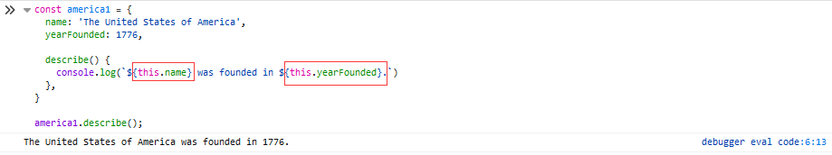
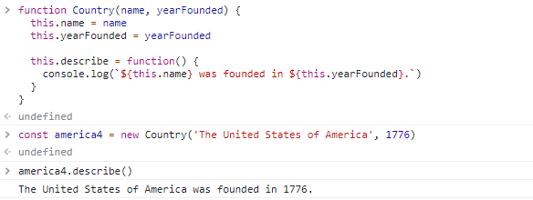
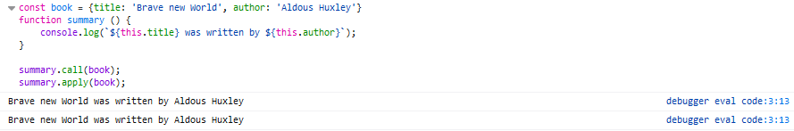

## Javascript中的this

`this`关键字在JavaScript中非常重要，它是一个对象的引用。引用的对象随着上下文的不同而不同。


-   全局上下文

直接在控制台中打印`this`，它指向的是windows对象


或者定义一个顶级的函数，它指向的也是windows对象

```javascript
function printThis() {
    console.log(this);
}
```


如果使用严格模式，this就会指向`undefined`


-   对象方法内

对象方法内的this指向对象本身

```javascript
const america = {
  name: 'The United States of America',
  yearFounded: 1776,

  describe() {
    console.log(`${this.name} was founded in ${this.yearFounded}.`)
  },
}
```



在嵌套对象内，`this`指向当前对象的作用域

```javascript
const america = {
  name: 'The United States of America',
  yearFounded: 1776,
  details: {
    symbol: 'eagle',
    currency: 'USD',
    printDetails() {
      console.log(`The symbol is the ${this.symbol} and the currency is ${this.currency}.`)
    },
  },
}

```

所以，this在对象方法内的指向，就是谁调用方法指向谁。


-   函数和类(在js中，类和函数是一样的)里面this，指向构造的实例。

```javascript
function Country(name, yearFounded) {
  this.name = name
  this.yearFounded = yearFounded

  this.describe = function() {
    console.log(`${this.name} was founded in ${this.yearFounded}.`)
  }
}

const america = new Country('The United States of America', 1776)

america.describe()
```




```javascript
class Country {
  constructor(name, yearFounded) {
    this.name = name
    this.yearFounded = yearFounded
  }

  describe() {
    console.log(`${this.name} was founded in ${this.yearFounded}.`)
  }
}
```


-   DOM事件处理

通过`addEventListener`添加的事件，`this`指向被监听事件的元素。

```javascript
const button = document.createElement('button')
button.textContent = 'Click me'
document.body.append(button)

button.addEventListener('click', function(event) {
  console.log(this);//这里的this和event.target是相同的
});

```


-   显式指定上下文

上面的每种情况都会有自己的特征。js通过call，apply和bind来显式的指定上下文。

call和apply的用法很相似，第一个参数是对象

call接收以逗号分隔的参数列表，而apply接收一个数组，以逗号分割的参数都放在数组中。


```javascript
const book = {title: 'Brave new World', author: 'Aldous Huxley'}
function summary () {
    console.log(`${this.title} was written by ${this.author}`);
}

summary.call(book); //summary中this的指向book参数
summary.apply(book);//summary中this的指向book参数
```




所以，这里传入的第一个参数，就是this上下文指定的对象。

call和apply都是一次性绑定，一旦调用完成，原始函数中的this还是保持不变。如果想绑定后多次调用保持this的指向不变，可以使用bind方法。


```javascript
const brave = summary.bind(book);
brave();
```


-   箭头函数

箭头函数没用它自己的this绑定。

```javascript
const whoAmI = {
  name: 'Leslie Knope',
  regularFunction: function() {
    console.log(this.name)
  },
  arrowFunction: () => {
    console.log(this.name)
  },
}

whoAmI.regularFunction() // "Leslie Knope"
whoAmI.arrowFunction() // <empty string>
```

箭头函数用于指向作用域之外的一个对象比较方便。例如：

```javascript
const button2 = document.createElement('button')
  button2.textContent = 'Click me'
  document.body.append(button2)

  class Display {
    constructor() {
      this.buttonText = 'New text'

      button2.addEventListener('click', event => {
        //this绑定到button，如果不用箭头函数，this就是event.target
        event.target.textContent = this.buttonText; 
      })
    }
  }

  new Display()
```

