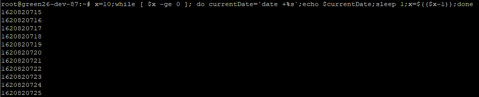

# Linux shell Loop

### 语法

Linux下执行循环语句，可以在给定的条件下循环执行do/done之间的语句；

```shell
while []
do
	commands
done
```

或

```shell
while [];do commands; done
```


## 举例

```shell
touch /tmp/showDate.sh
chmod 755 /tmp/showDate.sh
vi /tmp/showDate.sh
```


```shell
#!/bin/bash

x=10
while [ $x -ge 0 ]
do
        currentDate=`date +%s`;
        echo $currentDate;
        sleep 1;
        x=$(($x-1));
done
```

或

```shell
x=10;while [ $x -ge 0 ]; do currentDate=`date +%s`;echo $currentDate;sleep 1;x=$(($x-1));done
```




