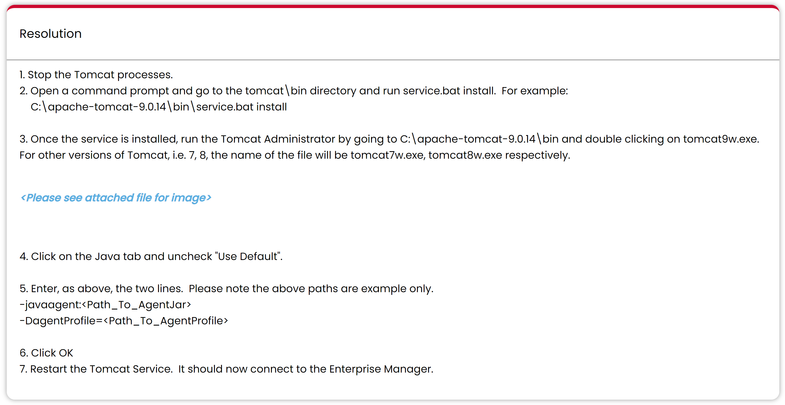

### window set java agent for tomcat

>    https://docs.newrelic.com/docs/apm/agents/java-agent/additional-installation/include-java-agent-jvm-argument/

```shell
SET "CATALINA_OPTS=%CATALINA_OPTS% -javaagent:/full/path/to/newrelic.jar"
```


