# MySQL 数据类型


- :clown_face: VARCHAR 

在 MySQL 中， `VARCHAR` 是可变长度的字符串类型，这与 `CHAR` 数据类型有所不同。当一个列的类型定义为 `VARCHAR` 类型后，列中的内容的长度就是内容本身的长度（字符数）。

定义数据库表结构的时候，可以定义字段的类型为`varchar`类型，如果省略长度，默认长度是255。

注意：

1.  长度是指可以存储的字符的个数。

2.  VARCHAR类型的长度限制：65535字节。

    （为什么用字节，而不是字符？跟编码有关系：latin1 -1， utf8 - 3, utf8mb4 - 4）

3.   MySQL 存储 `VARCHAR` 数值时，会将最前的 1 或者 2 个字节存储为实际字符串内容的长度。如果列的值少于 255 个字节，则长度前缀为 1 个字节，否则为 2 个字节。 

4.  在 MySQL 中，除了 `TEXT` 和 `BLOB` 列， 行大小限制为 `65535` 个字节。那么 `VARCHAR` 最多长度为 `65535` 个字节。此外，一个 `VARCHAR` 列中能够存储多少个字符还和数据库使用的[字符集](https://www.sjkjc.com/mysql/character-set/)有关。

5.  当varchar中的允许为NULL的时候，最大字节数再减去1；

 

1.  语法

```sql
create table t1_varchar (
	field_name varchar(3) not null default ''
);

## (65535-2)/4 = 16383
create table t2_varchar (
    field_name varchar(16383) not null default ''
);
## 正例
insert into t2_varchar(field_name) values('16383');

## 错例
insert into t2_varchar(field_name) values(NULL);
## [23000][1048] Column 'field_name' cannot be null
## 原因:t2.field_name不允许为NULL，插入失败


## (65535-2-1) /4 = 16383
create table t3_varchar (
    field_name varchar(16383) null
);

## 正例
insert into t3_varchar(field_name) values('16383');
insert into t3_varchar(field_name) values(NULL);
```


1.  示例

```sql
## 错例
CREATE TABLE test_varchar_latin1 (v VARCHAR(65535))
CHARACTER SET 'latin1';

## [42000][1118] Row size too large. The maximum row size for the used table type, not counting BLOBs, is 65535. This includes storage overhead, check the manual. You have to change some columns to TEXT or BLOBs
## 原因: 65535 - 2 - 1 = 65532

## 错例
CREATE TABLE test_varchar_utf8 (v VARCHAR(65535))
CHARACTER SET 'utf8';
## [42000][1074] Column length too big for column 'v' (max = 21845); use BLOB or TEXT instead
## 原因: 65532 - 2 - 1 除以 3 = 21844

## 错例
CREATE TABLE test_varchar_utf8mb4 (v VARCHAR(65535))
CHARACTER SET 'utf8mb4';
## [42000][1074] Column length too big for column 'v' (max = 16383); use BLOB or TEXT instead
## 原因:  65532 - 2 - 1 除以 4 = 16383
```


1.  特点

varchar(这列存储的最大字符数).

如果超过最大字符数的情况,分2种情形处理:

-   截断后插入,产生警告

-   抛异常,无法完成插入

举例说明:

```sql
create table sakila.test_varchar(
    id   bigint auto_increment primary key,
    name varchar(3) default '' not null
);

## 正例
insert into test_varchar(name) values
('aaa'),
('中中中');

2 rows affected in 4 ms

## 警告
insert into test_varchar(name) values
('bbb  '), #两个空格
('中中中    ') #3个空格; 

[2023-07-07 17:41:12] [01000][1265] Data truncated for column 'name' at row 1
[2023-07-07 17:41:12] [01000][1265] Data truncated for column 'name' at row 2
[2023-07-07 17:41:12] 2 rows affected in 4 ms

## 异常
insert into test_varchar(name) values
('bbba');

#[22001][1406] Data truncation: Data too long for column 'name' at row 1

## 查询
select * from test_varchar;
```

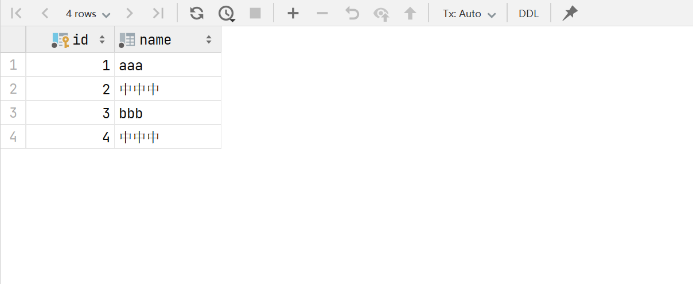


- :hear_no_evil: CHAR

 在 MySQL 中， `CHAR` 是固定长度的字符串类型，这与 `VARCHAR` 数据类型有所不同。当一个列的类型定义为 `CHAR` 类型后，列中的内容的长度就是字段定义的长度（字符数）。 

1.  语法

```sql
create table test_char (
    id bigint(20) auto_increment primary key ,
    name char(3) not null default ''
);

insert into test_char (name)
values ('1');

select length(name) from test_char;

```

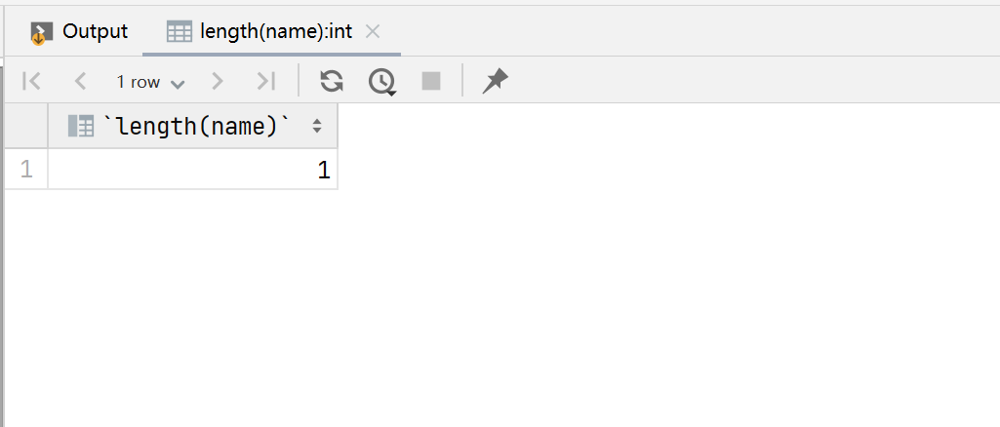

这里：

-   `length` 是一个数值，它指示了此列的字符数。此例定义为3,表示最多可以容纳3个字符.
-   `length` 可以是 `0` 到 `255` 之间的任何值。
-   如果我们不指定此值，则默认值是 `1`。也就是说 `CHAR` 等同于 `CHAR(1)`。


```sql
insert into test_char (name)
values ('123');
select id, name from test_char;
```

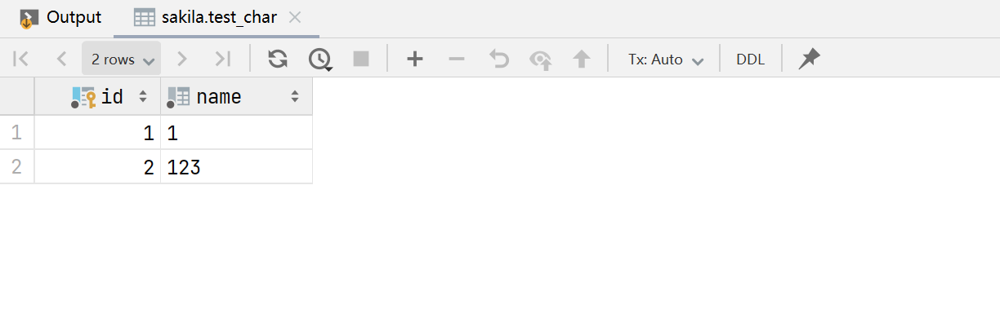

```sql
##　反例
insert into test_char(name)
values('1234');

## [22001][1406] Data truncation: Data too long for column 'name' at row 1

```

2.  特点:

-   写入 `CHAR` 列中的字符串的长度小于指定的字符长度，MySQL 会在源字符串后填充空格一直到指定的长度。当您读取 `CHAR` 列中的值时，MySQL 会删除后面的空格。

-   由于 `CHAR` 数据类型采用固定的长度进行存储，因此 `CHAR` 的性能要比 `VARCHAR` 更好。
-   由于读取数据的时候,无论这些空格是自动补齐的还是原来数据固有的,会自动删除尾部的空格,当一个 `CHAR` 列为唯一列时这个可能会产生问题.

3.  示例

-    省略length,默认长度为1
-   插入超过长度的,不会截断,会抛异常

```sql
create table test_char(
    name char not null
);

desc test_char;
```

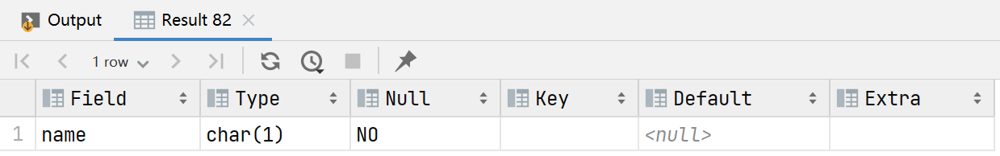

```sql
insert into test_char(name) values('22');
```

`[22001][1406] Data truncation: Data too long for column 'name' at row 1`

```sql
alter table test_char
modify column name char(5) not null;
```


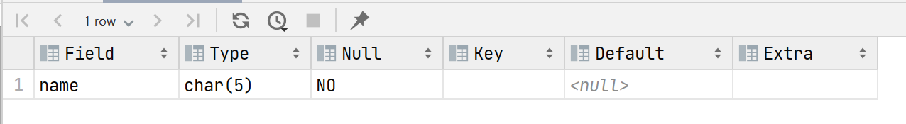

```sql
insert into test_char(name) values('22');
select name from test_char t1;
```

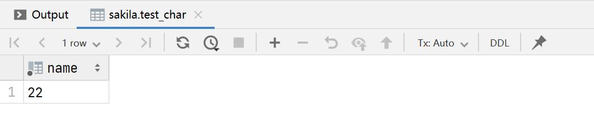

- :card_index_dividers: INT

在 MySQL 中，`INT` 和 `INTEGER` 是整数数据类型。为了更高效的存储不同长度的数字，MySQL 支持几种不同的整数数据类型： `INT`, `SMALLINT`, `TINYINT`, `MEDIUMINT` 和 `BIGINT`。 

下表展示了不同的整数类型的字节数和数值范围： 

| 类型        | 字节数 | 最小值              | 最大值               | 最小值(无符号) | 最大值(无符号)       |
| ----------- | ------ | ------------------- | -------------------- | -------------- | -------------------- |
| `TINYINT`   | `1`    | `-128` -2^7         | `127` 2^7-1          | `0`            | `255` 2^8 -1         |
| `SMALLINT`  | `2`    | `-32768` -2^15      | `32767` 2^15 -1      | `0`            | `65535` 2^16 -1      |
| `MEDIUMINT` | `3`    | `-8388608` -2^24    | `8388607 `2^24 -1    | `0`            | `16777215` 2^24-1    |
| `INT`       | `4`    | `-2147483648` -2^31 | `2147483647` 2^31 -1 | `0`            | `4294967295` 2^32 -1 |
| `BIGINT`    | `8`    | `-2^63`             | `2^63-1`             | `0`            | `2^64-1`             |

1.  语法

```sql
INT(length) [UNSIGNED]
```

length -- 标识显示长度,不是存储的长度.存储的最大值和最小值,参考上面的表格.

unsigned -- 标识此字段是无符号(即:非负数)


1.  特点

-    `INT` 数据类型列用来存储整数，比如年龄，数量等，它也可以结合 `AUTO_INCREMENT`作为主键列。 
-   `INT`数据类型的最大值是-2^31~2^31-1


1.  示例

```sql
## 创建一个表, 表名是:test_int.包含两个字段name和age.
## name 是varchar类型,容纳字符的最大个数20个,不能为null,默认为'';
## aget 是int类型,最大显示长度为默认(11),不能为null,默认为0

create table test_int(
    name varchar(20) not null default '' comment '名字',
    age int not null default 0 comment '年龄'
);

show columns from test_int;
```

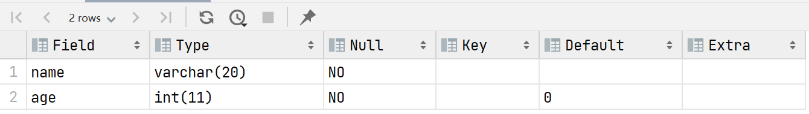


```sql
insert into test_int(name, age)
values('jim', -pow(2, 31));

insert into test_int(name, age)
values('jim', pow(2, 31) - 1);
```


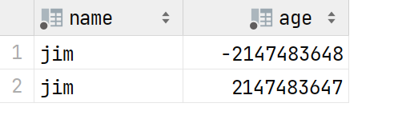

```sql
## age字段如果不存储负数,最大大小损失一半.添加`unsigned`;修改以后就无法存储负数了.
alter table test_int
    modify column age int unsigned not null default 0 comment '年龄';

insert into test_int(name, age)
values ('jim', -pow(2, 31));

[22001][1264] Data truncation: Out of range value for column 'age' at row 1
```


```sql
## 但是正数的大小却翻倍了
insert into test_int(name, age)
values ('liu', pow(2, 32) - 1);
```


```sql
## 使用int做自增id
alter table test_int
    add column id bigint primary key auto_increment comment '自增id' first ;
    

       
## 查看id是否已经起作用: 
## 上面的语句添加了id字段为第一个字段
## id是步长为1,自增,bigint类型,默认显示长度为20,并且不能为null但是无默认值,添加了名的PRIMARY的唯一性索引,添加了名称为PRIMARY的主键.
```

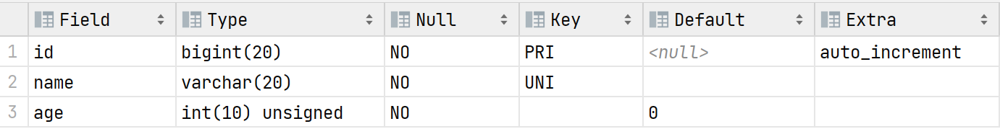


```sql
insert into test_int(name, age)
values ('sam', pow(2, 32) - 1),
       ('Jim', 0);
```

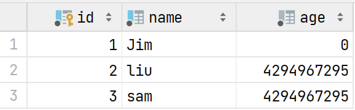


zerofill和显示长度在MySQL8.0的后续版本中会逐渐删除.如果需要显示进行格式化对其,使用`lpad(column_name, length, pad_str)`进行处理.

```sql
select lpad(id, 20, '0') as id, name, lpad(age, 20, '0') as age from test_int;
```

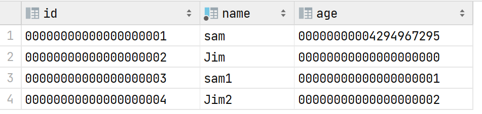

- :full_moon: DECIMAL

在 MySQL 中， `DECIMAL` 数据类型是定点数数据类型，用来存储精确的数值，比如账务金额等。底层实现上，MySQL 使用二进制形式存储该类型的值。 

 DECIMAL从[MySQL](https://cloud.tencent.com/product/cdb?from=20065&from_column=20065) 5.1引入，列的声明语法是DECIMAL(M,D)。NUMERIC与DECIMAL同义，如果字段类型定义为NUMERIC，则将自动转成DECIMAL。 

注:如果需要存储精确的数据:例如财务数据,应该将数据在存储之前乘以一个比例数据如:1000,这样在浮点数运算的时候,可以极大的提供便利,而且还能减小损失.


1.  语法

为了存储精确的数值，我们需要为 `DECIMAL` 数据类型指定总位数和小数位数。这里是 `DECIMAL` 数据类型的语法： 

DECIMAL [(M[,D])] [UNSIGNED] [ZEROFILL] 

-   M - 总的数字长度(精度),不包括小数点"."和正负号"+","-".范围是1~65,可以不指定,默认值:10
-   D - 小数位数的长度(整数部分的长度为M-D),范围是0~30,并且不能大于M.可以不指定,默认是0;
-   UNSIGNED - 标识此字段为非负数
-   ZEROFILL - 标识此字段的整数部分位数不足设定长度时用"0"来填充长度.带有 `ZEROFILL` 的列将自动具有 `UNSIGNED` 属性。这和 INT 数据类型一样。 

例如: salary decimal(5,2).表示存储2位小数,3位整数的任何值.因此存储的值的范围是:

-999.99 ~ 999.99

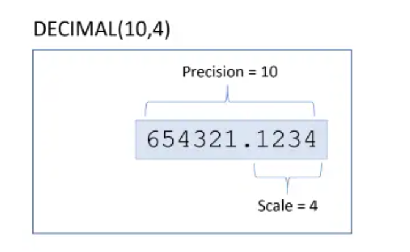

MySQL assigns the storage for integer and fractional parts separately. MySQL uses binary format to store the `DECIMAL` values. It packs 9 digits into 4 bytes.

For each part, it takes 4 bytes to store each multiple of 9 digits. The storage required for leftover digits is illustrated in the following table:

| **Leftover Digits** | **Bytes** |
| :------------------ | :-------- |
| 0                   | 0         |
| 1–2                 | 1         |
| 3–4                 | 2         |
| 5–6                 | 3         |
| 7–9                 | 4         |

For example, `DECIMAL(19,9)` has 9 digits for the fractional part and 19-9 = 10 digits for integer part. The fractional part requires 4 bytes. The integer part requires 4 bytes for the first 9 digits, for 1 leftover digit, it requires 1 more byte. In total, the `DECIMAL(19,9)` column requires 9 bytes.

>   详情见：https://www.mysqltutorial.org/mysql-decimal/


1.  示例

```sql
## 创建具有decimal(Number)的字段的表结构,验证其默认值.
create table decimal_tb (col1 decimal, col2 decimal(5,2));
## 显示创建表的语句
show create table decimal_tb;
```

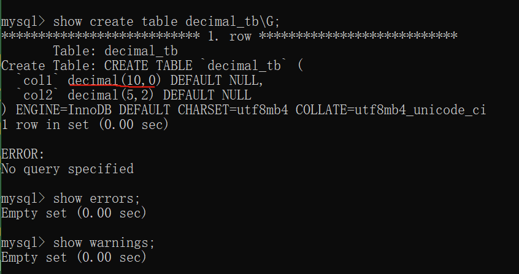

默认:

-   M - 10

-   D - 0

```sql
## 测试可以插入的数据
mysql> insert into decimal_tb (col1) values(9999999999);
Query OK, 1 row affected (0.00 sec)

mysql> insert into decimal_tb (col1) values(9876543210);
Query OK, 1 row affected (0.00 sec)

mysql> insert into decimal_tb (col1) values(9876543210.00);
Query OK, 1 row affected (0.00 sec)

mysql> insert into decimal_tb (col1) values(9876543210.01);
Query OK, 1 row affected, 1 warning (0.00 sec)

mysql> insert into decimal_tb (col1) values(98765432101);
ERROR 1264 (22003): Out of range value for column 'col1' at row 1

mysql> select * from decimal_tb;
+------------+-------+
| col1       | col2  |
+------------+-------+
|       NULL | 12.24 |
| 9999999999 |  NULL |
| 9876543210 |  NULL |
| 9876543210 |  NULL |
| 9876543210 |  NULL |
+------------+-------+
5 rows in set (0.00 sec)
```

```sql
drop table if exists decimal_tb;
create table decimal_tb (
    col1 decimal,
    col2 decimal(5,2)
);

## 最多存3个整数
insert into decimal_tb (col2) values (9999);
#[22001][1264] Data truncation: Out of range value for column 'col2' at row 1
insert into decimal_tb (col2) values (999);
## 最多存储2位小数，多出来的会以四舍五入的方式截断
insert into decimal_tb (col2) values (999.99);
select col2 from decimal_tb;
```

测试M和D的范围:

M - 包括左右两侧的数字总长度,大小范围:0~65

D - 小数位的长度:0~30

整数位的长度是: M - D,且M必须大于等于D

```sql
alter table decimal_tb
add column col4 decimal(6, 7) after col3;
#[42000][1427] For float(M,D), double(M,D) or decimal(M,D), M must be >= D (column 'col4').
alter table decimal_tb
    drop column col4;
alter table decimal_tb add column col4 decimal(66, 32) after col3;
#[42000][1425] Too big scale 32 specified for column 'col4'. Maximum is 30.
alter table decimal_tb modify column  col4 decimal(66, 30);
#[42000][1426] Too-big precision 66 specified for 'col4'. Maximum is 65.
```

-   总结

DECIMAL类型的使用方法及注意事项，你可能也知道float、double这些浮点数类型，这两个同样可以存储小数，但这里不过多介绍，只是提醒大家float、double类型无法确保精度，很容易产生误差，特别是在求和计算的时候，所有当存储小数，特别是涉及金额时推荐使用DECIMAL类型。这里总结下使用DECIMAL应该注意的事项：

-   DECIMAL(M,D)中，M范围是1到65，D范围是0到30。
-   M默认为10，D默认为0，D不大于M。
-   DECIMAL(5,2)可存储范围是从-999.99到999.99，超出存储范围会报错。
-   存储数值时，小数位不足会自动补0，首位数字为0自动忽略。
-   小数位超出会截断，产生告警，并按四舍五入处理。
-   使用DECIMAL字段时，建议M，D参数手动指定，并按需分配。

```sql
create table test_decimal
(
    id bigint auto_increment primary key ,
    name varchar(20) not null default  '',
    balance decimal(10, 4) not null default 0.0
);
desc test_decimal;
```

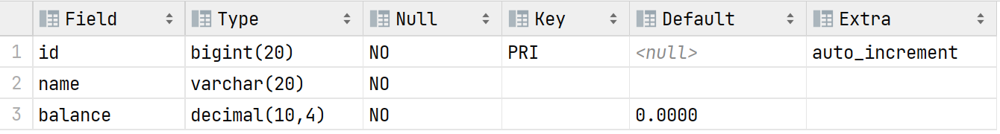


```sql
## 插入数据
insert into test_decimal(name, balance)
values('Tim', 1500.04),
      ('Jim', 10000),
      ('Tom', 33333.49);
```

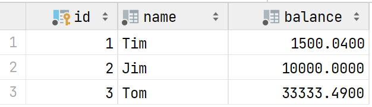


```sql
mysql> alter table customer_balance  modify column balance decimal(14,4) zerofill not null default 0 comment 'balance';
Query OK, 3 rows affected (0.05 sec)
Records: 3  Duplicates: 0  Warnings: 0

mysql> select * from customer_balance;
+----+------+-----------------+
| id | name | balance         |
+----+------+-----------------+
|  1 | Tim  | 0000001500.0400 |
|  2 | Jim  | 0000010000.0000 |
|  3 | Tom  | 0000333333.4000 |
+----+------+-----------------+
3 rows in set (0.00 sec)
```


```sql
## 为字段name添加唯一性索引
alter table test_decimal
add unique index index_name (name) using btree ;

## 使用like字段查询
## 反例:无法使用索引

select name, balance
from test_decimal t1
where t1.name like '%im%'
limit 10;

## 正例:使用索引
select name, balance
from test_decimal t1
where t1.name like 'im%'
union
select name, balance
from test_decimal t2
where t2.name like '%im';

```

关于索引的有效性

Indexes are built from the start of the string towards the end. When you use `LIKE 'whatever%'` type clause, MySQL can use those start-based indexes to look for `whatever` very quickly.

But switching to `LIKE '%whatever%'` removes that anchor at the start of the string. Now the start-based indexes can't be used, because your search term is no longer anchored at the start of the string - it's "floating" somewhere in the middle and the entire field has to be search. Any `LIKE '%...` query can never use indexes.

That's why you use fulltext indexes if all you're doing are 'floating' searches, because they're designed for that type of usage.

Of major note: InnoDB now [supports fulltext](http://blogs.innodb.com/wp/2011/12/innodb-full-text-search-in-mysql-5-6-4/) indexes as of version 5.6.4. So unless you can't upgrade to at least 5.6.4, there's nothing holding you back from using InnoDB **AND* fulltext searches.

>   https://dba.stackexchange.com/questions/285336/having-charset-utf8mb4-does-it-mean-every-character-takes-4-bytes-or-only-t

MySQL的索引构建于字符串开始到结尾.所以当你使用`LIKE 'whatever%'`语句继续检索条件时,MySQL能够快速的使用基于开始到结尾的索引.但是使用`LIKE '%whatever'` 或者`%whatever%`,它会移除字符串的开头锚点.现在基于开始到结尾的索引将不再起作用,因为没有了字符串手不的锚点.所以任何基于`LIKE '%...'`的搜索条件将不会使用索引.

对于字符串检索,普通索引失效,可以`FULLTEXT`全文检索

首先，确定“||”操作符是逻辑OR还是字符连接：


```sql
mysql> show variables like '%sql_mode%'\G;
*************************** 1. row ***************************
Variable_name: sql_mode
        Value: PIPES_AS_CONCAT,STRICT_TRANS_TABLES,NO_ZERO_IN_DATE,NO_ZERO_DATE,ERROR_FOR_DIVISION_BY_ZERO,NO_AUTO_CREATE_USER,NO_ENGINE_SUBSTITUTION
1 row in set, 1 warning (0.00 sec)

ERROR:
No query specified

```

如果sql_mode中出现“PIPES_AS_CONCAT”，表示“||”操作符为连接字符串的

```sql
mysql> select 'aa' || 'bb' from dual;
+--------------+
| 'aa' || 'bb' |
+--------------+
| aabb         |
+--------------+
1 row in set (0.00 sec)

```

接下来，创建一个表`articles`

```sql
drop table if exists articles;
CREATE TABLE articles
(
    id    INT UNSIGNED AUTO_INCREMENT NOT NULL  PRIMARY KEY,
    title VARCHAR(200) not null default  '' comment '标题',
    body  TEXT not null collate utf8mb4_unicode_ci,
    FULLTEXT (title) WITH PARSER ngram,
    FULLTEXT (body) with parser ngram,
    FULLTEXT (title,body) with parser ngram
) COMMENT '文章表' character set utf8mb4 collate utf8mb4_unicode_ci engine innodb;
```

创建表结构的时候，分别为title，body和（title,body）建立了全文检索的索引。

为title创建普通索引和唯一性索引：

```sql
alter table articles
    add index title_index (title) using btree;


alter table articles
add unique index un_index_title (title) using btree ;

mysql> show index from articles;
+----------+------------+----------------+--------------+-------------+-----------+-------------+----------+--------+------+------------+---------+---------------+
| Table    | Non_unique | Key_name       | Seq_in_index | Column_name | Collation | Cardinality | Sub_part | Packed | Null | Index_type | Comment | Index_comment |
+----------+------------+----------------+--------------+-------------+-----------+-------------+----------+--------+------+------------+---------+---------------+
| articles |          0 | PRIMARY        |            1 | id          | A         |           3 |     NULL | NULL   |      | BTREE      |         |               |
| articles |          0 | un_index_title |            1 | title       | A         |           3 |     NULL | NULL   |      | BTREE      |         |               |
| articles |          1 | title_index    |            1 | title       | A         |           3 |     NULL | NULL   |      | BTREE      |         |               |
| articles |          1 | title          |            1 | title       | NULL      |           3 |     NULL | NULL   |      | FULLTEXT   |         |               |
| articles |          1 | body           |            1 | body        | NULL      |           3 |     NULL | NULL   |      | FULLTEXT   |         |               |
| articles |          1 | title_2        |            1 | title       | NULL      |           3 |     NULL | NULL   |      | FULLTEXT   |         |               |
| articles |          1 | title_2        |            2 | body        | NULL      |           3 |     NULL | NULL   |      | FULLTEXT   |         |               |
| articles |          1 | full_title     |            1 | title       | NULL      |           3 |     NULL | NULL   |      | FULLTEXT   |         |               |
+----------+------------+----------------+--------------+-------------+-----------+-------------+----------+--------+------+------------+---------+---------------+
8 rows in set (0.00 sec)
```


插入数据：

```sql
insert into articles(title, body)
values ('decimal',
        '在本文中，我们带您学习了 MySQL 中的定点数数据类型 DECIMAL。DECIMAL 数据类型可以用来表示很精确的数字。DECIMAL 数据类型具有 UNSIGNED 和 ZEROFILL 属性。'),
       ('varchar',
        '在 MySQL 中， VARCHAR 是可变长度的字符串类型，这与 CHAR 数据类型有所不同。当一个列的类型定义为 VARCHAR 类型后，列中的内容的长度就是内容本身的长度（字符数）。'),
       ('char',
        '在 MySQL 中， CHAR 是固定长度的字符串类型，这与 VARCHAR 数据类型有所不同。当一个列的类型定义为 CHAR 类型后，列中的内容的长度就是字段定义的长度（字符数）。');

```

使用全文检索：

再body中查询包含字符decimal，但是不包含字符char的记录：

```sql
select case when id between 0 and 9 then '0' || id else '' || id end as ID , title, body from articles
where match(body) against('-char +decimal' in boolean mode );

mysql> select case when id between 0 and 9 then '0' || id else '' || id end as ID , title, body from articles
    -> where match(body) against('-char +decimal' in boolean mode );
+------+---------+-------------------------------------------------------------------------------------------------------------------------------------------------------+
| ID   | title   | body                                                                                                                                                  |
+------+---------+-------------------------------------------------------------------------------------------------------------------------------------------------------+
| 01   | decimal | 在本文中，我们带您学习了 MySQL 中的定点数数据类型 DECIMAL。DECIMAL 数据类型可以用来表示很精确的数字。DECIMAL 数据类型具有 UNSIGNED 和 ZEROFILL 属性。 |
+------+---------+-------------------------------------------------------------------------------------------------------------------------------------------------------+
1 row in set (0.00 sec)
```


- :baby_bottle: BIT

在 MySQL 中 `BIT` 数据类型被用来存储二进制的位值。我们通常使用 `BIT` 数据类型的列存储状态值，比如布尔值，订单状态等。 `BIT` 数据类型也是易于扩展的。 

1.  语法

当我们使用 `BIT` 数据类型时，需要指定一个位数参数。这是语法：

```sql
BIT(M)
```

这里:

-   `BIT(M)` 允许存储 **`M`** 位值。 **`M`** 的取值范围是 `1` 到 `64`。
-   如果不指定 `M`，那么它的默认值为 `1`。 `BIT` 等效于 `BIT(1)`。

2. 特点 

当我们需要向 `BIT` 列中插入 `BIT` 值时，需要使用 `BIT` 字面量。 `BIT` 字面量可以使用如下格式：

-   `b'val'`
-   `B'val'`
-   `0bval`

这里 `val` 是二进制值，它仅包含 `0` 和 `1`。例如：

```sql
## 正例
b'01'
B'01'
0b01
```

注意，前导 `b` 和 `B` 是等效的。但是 `0b` 是正确的前导符号，而 `0B` 不是正确的前导符号。下面是几个不正确的 `BIT` 字面值：

```sql
## 反例
b'2'    -- 2 不是正确的 2 进制数
0B01    -- 不能用 0B 前导，应使用 0b
```

3.  示例

我们将创建一个订单状态表 `order_state`，表中包含了一个用来存储订单状态的 `state` 列。我们先预设订单有如下状态：

| 状态   | 状态十进制值 | 状态二进制值 |
| ------ | ------------ | ------------ |
| 待支付 | 0            | 000          |
| 已支付 | 1            | 001          |
| 待发货 | 2            | 010          |
| 已发货 | 3            | 011          |
| 已完成 | 4            | 100          |

```sql
drop table if exists custom_order;
create table custom_order
(
    id          bigint auto_increment primary key not null comment 'ID',
    order_no    varchar(20)                       not null default '' comment '订单号',
    order_state bit(5)                            not null default 0b00000 comment '订单状态\n 000 - 待支付 001 - 已支付，010 - 待发货 已发货 011 - 已签收 - 111'
);

## 添加订单编号和状态的唯一性索引
alter table custom_order
    add unique index un_index_order (order_no, order_state) using btree comment '订单号和订单状态的唯一性索引';

## 添加订单编号的索引
alter table custom_order
    add index index_order (order_no) using btree comment '订单编号索引';

## 添加订单状态的索引
alter table custom_order
    add index custom_order (order_state) using btree comment '订单状态索引';

## 添加逻辑删除字段
alter table custom_order
    add column is_deleted bit(1) not null default 0b0 comment '是否删除';

## 插入订单数据
insert into custom_order(order_no, order_state)
values ('202307133342', 0b001);

## 查询订单数据
select *
from custom_order;

update custom_order t1
set t1.order_state = 0b111
where t1.order_no = '202307133342'
  and t1.is_deleted = 0b0;ou

## 删除订单
update custom_order t1
set t1.is_deleted = true
where t1.order_no = '202307133342'
  and t1.is_deleted = false;
  
## 将BIT数据类型作为where条件
## 可以直接使用其对应的十进制或者 BIT 字面值。如下：
select order_no, order_state, (order_state + 0) as DEC_Value, BIN(order_state) as BIN_Value, OTC(order_state) as OTC_Value, HEX(order_state) as HEX_Value, is_deleted from custom_order t1
where t1.order_state = 7

OR t1.order_state = 0b111
OR t1.order_state = 0x3
OR t1.order_state = b'111'
OR t1.order_state = (3)
OR t1.order_state = B'111'

```

-   关于M的最大值是64，这样BIT类型字段的最大值用十六进制表示就是： FF FF FF FF FF FF FF FF

BIT所能存储的最大数跟BIGINT一样，最大字节数都是8个字节。

如果定义的字节长度超过64，MySQL就会抛出异常

```sql
alter table custom_order
modify column order_state bit(65) not null default 0 comment '订单状态, 000 - 待支付 001 - 已支付，010 - 待发货 已发货 011 - 已签收 - 111';
# [42000][1439] Display width out of range for column 'order_state' (max = 64)
```


- DATE

MySQL 中有五种[数据类型](https://www.sjkjc.com/mysql/data-type/)用于管理日期和时间，包括：`DATE`， `TIME`，[`DATETIME`](https://www.sjkjc.com/mysql/datetime/)， `TIMESTAMP` 和 [`YEAR`](https://www.sjkjc.com/mysql/year/)。本文中主要探讨 `DATE` 数据类型。

MySQL `DATE` 使用 `yyyy-mm-dd` 格式来存储日期值。如果您想以其他的日期格式显示，比如 `mm-dd-yyyy`，您可以使用 `DATE_FORMAT` 函数将日期格式化为您需要的格式。

MySQL `DATE` 类型值的范围从 `1000-01-01` 到 `9999-12-31`。

当您向 `DATE` 列中插入值时，您可以使用 `yyyy-mm-dd` 或者 `yy-mm-dd` 格式。

在严格模式下，您不能插入无效日期，比如：`2018-08-32`。否则 MySQL 会给出错误。在非严格模式下，MySQL 会将无效日期转为 `0000-00-00`。

但是，如果插入带时间格式的日期，比如: "2023-07-13 08:08:08",会被插入，并截断时间，只插入日期。


1.  语法

以下是创建 `DATE` 列的语法：

```sql
column_name DATE;
```

这里， 我们无需为 `DATE` 指定任何属性。

1.  特点

上面我们说过，您可以将 `yyyy-mm-dd` 或者 `yy-mm-dd` 格式的日期值插入到 `DATE` 列中。

如果您使用两位数的年份值，MySQL 仍然按照以下规则将它转为四位数的年份值：

-   `00-69` 范围内的年份值将转换为 `2000-2069`。
-   `70-99` 范围内的年份值将转换为 `1970-1999`。

虽然规则时明确的，但是，具有两位数的日期值会给读取您代码的人带来困惑，因此应该避免使用两位数的年份。

1.  示例

```sql
use sakila;
drop table if exists date_test;
create table date_test
(
	id           int unsigned not null auto_increment primary key comment 'ID',
	created_date date         not null comment '创建日期'
);

mysql> insert into date_test(id, create_date) values(
    -> null, '2023-07-13');
Query OK, 1 row affected (0.00 sec)

mysql> select id, date_format(create_date, '%Y-%m-%d %T') as create_datetime from date_test;
+----+---------------------+
| id | create_datetime     |
+----+---------------------+
|  1 | 2023-07-13 00:00:00 |
+----+---------------------+
1 row in set (0.00 sec)
```


之后，使用两位数的年份格式将数据插入 `people` 表中。


```sql
INSERT INTO test_date(created_date)
VALUES ('09-09-09'),  ('99-09-09');
```

这里，根据转换规则，年份 `09` 将被转换为 `2009`，`99` 将被转换为 `1999`。

```sql
mysql> select id, date_format(create_date, '%Y-%m-%d %T') as create_datetime from date_test;
+----+---------------------+
| id | create_datetime     |
+----+---------------------+
|  1 | 2023-07-13 00:00:00 |
|  2 | 2009-09-09 00:00:00 |
|  3 | 1999-09-09 00:00:00 |
+----+---------------------+
3 rows in set (0.00 sec)
```


插入错误的日期：

```sql
mysql> insert into date_test (create_date) values ('2023-02-39');
ERROR 1292 (22007): Incorrect date value: '2023-02-39' for column 'create_date' at row 1
```

利用last_day()和current_date()返回某个月的起止日期：

```sql
## 当前日期是：2023-07-13
## 返回今年2月份的起止日期
mysql> select (last_day(current_date - interval 6 month ) + interval  1 day) as first_day,
    ->        (last_day(current_date - interval 5 month )) as last_day;
+------------+------------+
| first_day  | last_day   |
+------------+------------+
| 2023-02-01 | 2023-02-28 |
+------------+------------+
1 row in set (0.00 sec)

## 返回当前月的起止日期
mysql> select (last_day(current_date) - interval 1 month + interval 1 day) as first_day,
    ->        (last_day(current_date)) as last_day;
+------------+------------+
| first_day  | last_day   |
+------------+------------+
| 2023-07-01 | 2023-07-31 |
+------------+------------+
1 row in set (0.00 sec)

## 相关的日期函数
## 获取当前日期和系统时间
mysql> select now() as currentDatetime;
+---------------------+
| currentDatetime     |
+---------------------+
| 2023-07-14 10:21:40 |
+---------------------+
1 row in set (0.00 sec)

## 获取当前系统日期
mysql> select curdate() from dual;
+------------+
| curdate()  |
+------------+
| 2023-07-14 |
+------------+
1 row in set (0.00 sec)

## 获取一个日期时间字符串的日期部分
mysql> select date('2023-07-04 15:28:49T2332.Z');
+------------------------------------+
| date('2023-07-04 15:28:49T2332.Z') |
+------------------------------------+
| 2023-07-04                         |
+------------------------------------+
1 row in set, 1 warning (0.00 sec)

## 根据当前的时间，格式化日期和时间
mysql> select date_format(now(), '%m/%d/%Y %r');
+-----------------------------------+
| date_format(now(), '%m/%d/%Y %r') |
+-----------------------------------+
| 07/14/2023 10:27:08 AM            |
+-----------------------------------+
1 row in set (0.00 sec)


use sakila;
drop table if exists date_test;

create table date_test
(
	id          int unsigned not null auto_increment primary key comment 'ID',
	created_date date         not null comment 'create date'
) character set utf8mb4
  collate utf8mb4_unicode_ci;

show full columns from date_test;

insert into date_test(created_date)
values ('2023-07-13 18:53:33');

select *
from date_test;

insert into date_test(id, created_date)
VALUES (NULL, DATE(now()));

select date_format(created_date, '%m/%d/%Y') as create_date
from date_test;

insert into date_test(created_date)
values(date_format(current_date, '%Y-%m-%d')), (date_format(current_date + interval 5 day, '%y-%m-%d'));

insert into date_test(id, created_date)
values (null, date(current_date));

show variables like '%sql_mode%';

select last_day(current_date);

select (last_day(current_date - interval 6 month) + interval 1 day) as first_day,
	   (last_day(current_date - interval 5 month))                  as last_day;


select (last_day(current_date) - interval 1 month + interval 1 day) as fist_day,
	   (last_day(current_date));

insert into date_test(created_date)
values (date_format(current_date, '%Y-%m-%d'));

select *
from date_test;
select date_format(current_date, '%m/%d/%Y');

## 无法插入
insert into date_test(created_date)
values (date_format(current_date, '%m/%d/%Y'));

insert into date_test(created_date)
values(date_format(current_date, '%y-%m-%d'));

select current_date()
from dual;
select date_format(current_date(), '%m/%d/%y') as date;

select current_date - interval 5 month;

select datediff(current_date(), current_date() - interval 5 month) as diff_days;

select datediff(tomorrow, today)
from (select date(current_date) as today, date(current_date) + interval 1 day as tomorrow) as ttdiff;


select datediff(tomorrow, today)
from (select date(current_date) as today, date(current_date) + interval 5 day as tomorrow) as ttdiff
where exists (select datediff(tomorrow, today) >= 1);


select datediff(tomorrow, today) as diff
from (select date(current_date) as today, date(current_date) + interval 5 day as tomorrow) as ttdiff
where (tomorrow - today) < 0;


select current_date()                    as '今天',
	   (current_date() - interval 1 day) as '昨天',
	   (current_date() - interval 2 day) as '前天',
	   (current_date() + interval 1 day) as '明天',
	   (current_date + interval 1 week)  as '一周后',
	   (current_date + interval 1 month) as '一月后',
	   (current_date + interval 10 year) as '10年后'
;

select date_add(current_date, interval 1 day) as tomorrow;
select date_add(date('2023-07-18 19:39:29'), interval -1 day) as last_day;
select date_add('2022-07-28 23:32:32', interval 1 hour);
select date_sub(current_date, interval 1 day);
select timestamp('2022-07-17 19:40:23');
select date_sub(date('2022-07-17 19:40:23'), interval -1 month) as next_day;

select day(current_date);
select day(created_date)               as day1,
	   date_format(created_date, '%d') as `day2`
from date_test;

select month(current_date);
select month(created_date) as month1, date_format(created_date, '%m')
from date_test;
select quarter(date('2023-12-18 23:23:32')) as quarter
from date_test;

select year(current_date);
select year(current_date - interval 1 year);
select date(date_add('2013-03-26', interval 18 year));
select year(date_add('2013-03-26', interval 18 year));
select week(date_add('2013-03-26', interval 18 year));
select week(current_date);
select week(concat('2023-01-', jun_last_day))
from (select day(last_day(current_date - interval 6 month)) as jun_last_day) as jun_week;

## 返回工作日索引（周日为0）
select weekday(current_date + interval 0 day);
## 返回一年的第几周
select weekofyear(current_date + interval 6 day);

```


- DATETIME

在 MySQL 中，您使用 `DATETIME` 来存储包含日期和时间的值。当您从 `DATETIME` 列中查询数据时，MySQL `DATETIME` 列的值以下格式显示： 

```sql
YYYY-mm-dd HH:MM:SS
4位年-2位月-2位日 24小时制小时:2位分钟:2位秒
```


1.  语法

```sql
drop table if exists date_test;
create table if  not exists date_test(
    id int unsigned not null auto_increment primary key ,
    created_time datetime not null default now() ,
    updated_time datetime not null default now() on update now()
);
show full columns from date_test;


insert into date_test values ();
select * from date_test;
update date_test t1
set t1.id = 2
where t1.id = 1;
```


1.  特点

 默认情况下， `DATETIME` 值范围从 `1000-01-01 00:00:00` 到 `9999-12-31 23:59:59` 。 

一个 `DATETIME` 值使用 5 个字节进行存储。此外，一个 `DATETIME` 值可以包括一个尾随小数秒，格式为： `YYYY-MM-DD HH:MM:SS[.fraction]`。 例如， `2015-12-20 10:01:00.999999` 。当包括小数秒精度时， `DATETIME` 值需要更多的存储空间，如下表所示：

| 小数秒精度 | 存储（字节） |
| ---------- | ------------ |
| 0          | 0            |
| 1、2       | 1            |
| 3、4       | 2            |
| 5、6       | 3            |

例如， `2015-12-20 10:01:00.999999` 需要 8 个字节，5 个字节用于 `2015-12-20 10:01:00` 和 3 个字节用于 `.999999`。 而 `2015-12-20 10:01:00.9` 只需要 6 个字节，1 个字节用于小数秒精度。

请注意，在 MySQL 5.6.4 之前， `DATETIME` 值需要 8 个字节的存储空间，而不是 5 个字节。

MySQL 提供了另一种类似于 `DATETIME` 的 时间数据类型 `TIMESTAMP` 。

`TIMESTAMP` 需要 4 个字节，而 `DATETIME` 需要 5 个字节。`TIMESTAMP` 和 `DATETIME` 二者都需要额外字节存储小数秒。

`TIMESTAMP` 值范围从 `1970-01-01 00:00:01 UTC` 到 `2038-01-19 03:14:07 UTC` 。如果要存储超过 2038 年的时间值，则应使用 `DATETIME` 代替 `TIMESTAMP` 。


1.  示例

```sql
create table if not exists time_test
(
	id int unsigned auto_increment primary key not null,
	ts timestamp                               not null default current_timestamp,
	dt datetime                                not null default current_timestamp
);

alter table time_test
	add column ts2 timestamp not null default current_timestamp on update current_timestamp,
	add column dt2 datetime  not null default current_timestamp on update current_timestamp,
	add column value int not null default 0;
	
show full columns from time_test;

+-----+----------------+---------+----+---+-----------------+---------------------------+-------------------------------+-------+
|Field|Type            |Collation|Null|Key|Default          |Extra                      |Privileges                     |Comment|
+-----+----------------+---------+----+---+-----------------+---------------------------+-------------------------------+-------+
|id   |int(10) unsigned|null     |NO  |PRI|null             |auto_increment             |select,insert,update,references|       |
|ts   |timestamp       |null     |NO  |   |CURRENT_TIMESTAMP|                           |select,insert,update,references|       |
|dt   |datetime        |null     |NO  |   |CURRENT_TIMESTAMP|                           |select,insert,update,references|       |
|ts2  |timestamp       |null     |NO  |   |CURRENT_TIMESTAMP|on update CURRENT_TIMESTAMP|select,insert,update,references|       |
|dt2  |datetime        |null     |NO  |   |CURRENT_TIMESTAMP|on update CURRENT_TIMESTAMP|select,insert,update,references|       |
|value|int(11)         |null     |NO  |   |0                |                           |select,insert,update,references|       |
+-----+----------------+---------+----+---+-----------------+---------------------------+-------------------------------+-------+

## datetime和timestamp两种字段的默认值
truncate table time_test;

insert into time_test(value)
values(1);
+--+-------------------+-------------------+-------------------+-------------------+-----+
|id|ts                 |dt                 |ts2                |dt2                |value|
+--+-------------------+-------------------+-------------------+-------------------+-----+
|1 |2023-07-20 10:59:49|2023-07-20 10:59:49|2023-07-20 10:59:49|2023-07-20 10:59:49|1    |
+--+-------------------+-------------------+-------------------+-------------------+-----+


## 结论：设置默认值为current_timestamp时，会按照当前的时区，将系统日期和时间写入。

## 如果表中有多个timestamp字段，必须显式声明字段为null或者not null
## 当datetime或timestamp字段为not null时，默认值必须是：current_timestamp，不可以为0或者'0000-00-00 00:00:00'，否则会抛出异常：默认值无效
## datetime和timestamp的最大值和最小值
truncate table time_test;
set time_zone = "+00:00";
insert into time_test(ts, dt, ts2, dt2, value)
values(now(), now(), now(), now(), 1),
	  ('2038-01-19 03:14:07','9999-12-31 00:00:00', '2038-01-19 03:14:07', '9999-12-31 23:59:59', 2);

insert into time_test(ts3, dt3)
values('1970-01-01 00:00:01', '1000-01-01 00:00:00'),
      ('2038-01-19 03:14:07', '9999-12-31 23:59:59');

## datetime字段的范围：'1000-01-01 00:00:00' ~ '9999-12-31 23:59:59'
## timestamp字段的范围：'1970-01-01 00:00:01' ~ '2038-01-19 03:14:07'
+--+-------------------+-------------------+-------------------+-------------------+-----+-------------------+-------------------+-------------------+-------------------+
|id|ts                 |dt                 |ts2                |dt2                |value|ts3                |dt3                |ts4                |dt4                |
+--+-------------------+-------------------+-------------------+-------------------+-----+-------------------+-------------------+-------------------+-------------------+
|1 |2023-07-20 03:45:02|2023-07-20 03:45:02|2023-07-20 03:45:02|2023-07-20 03:45:02|1    |null               |null               |2023-07-20 03:45:02|2023-07-20 03:45:02|
|2 |2038-01-19 03:14:07|9999-12-31 00:00:00|2038-01-19 03:14:07|9999-12-31 23:59:59|2    |null               |null               |2023-07-20 03:45:02|2023-07-20 03:45:02|
|3 |2023-07-20 03:45:02|2023-07-20 03:45:02|2023-07-20 03:45:02|2023-07-20 03:45:02|0    |1970-01-01 00:00:01|1000-01-01 00:00:00|2023-07-20 03:45:02|2023-07-20 03:45:02|
|4 |2023-07-20 03:45:02|2023-07-20 03:45:02|2023-07-20 03:45:02|2023-07-20 03:45:02|0    |2038-01-19 03:14:07|9999-12-31 23:59:59|2023-07-20 03:45:02|2023-07-20 03:45:02|
+--+-------------------+-------------------+-------------------+-------------------+-----+-------------------+-------------------+-------------------+-------------------+
## timestamp的时间最大值是2038年3月14日3点14分7秒，如果要存储超过这个时间的值，应该选择`datetime`类型，而不是timestamp类型。
## timestamp类型的值会随着时区的改变而发生变化。比如：当前存储的时区是"+00:00"，如果时区变成"+08:00"，那么timestamp的值会自动的+8个小时。但是datetime类型的不会发生变化。
## timestamp类型的值在存储和查询的时候，会自动计算时区。比如：在存储的时候，如果时区是"+08:00"，那么timestamp的最小值应该是"1970-01-01 08:00:00"，而不是"1970-01-01 00:00:00".如果我们在8时区存入的值，时区改成0时区，取出的值也会自动减去8小时。
select ts2, dt2 from time_test
where id = 1;
+-------------------+-------------------+
|ts2                |dt2                |
+-------------------+-------------------+
|2023-07-20 05:40:55|2023-07-20 13:40:55|
+-------------------+-------------------+

## timestamp和datetime类型的字段都可以设置为null，当不指定存储值时，会返回null值。

## 关于"on update current_datetime"
## 如果时间字段加上这条语句，记录在更新的时候，就会把时间字段更新为当前的更新时刻系统时间,这是因为timestamp类型的字段以UTC（协调世界时（英语：Coordinated Universal Time，法语：Temps Universel Coordonné，简称UTC））。

select ts2, dt2 from time_test
where id = 1;
+-------------------+-------------------+
|ts2                |dt2                |
+-------------------+-------------------+
|2023-07-20 13:36:11|2023-07-20 13:36:11|
+-------------------+-------------------+

update time_test set value = 4
where id = 1;
select ts2, dt2 from time_test
where id = 1;
+-------------------+-------------------+
|ts2                |dt2                |
+-------------------+-------------------+
|2023-07-20 13:40:55|2023-07-20 13:40:55|
+-------------------+-------------------+

## 但是如果更新的值与原来存储的值相同，也就是值并未真正更新，那么时间是不会发生变化的。

## MySQL YEAR、QUARTER、MONTH、WEEK、DAY、HOUR、MINUTE 和 SECOND 函数
## 要从 DATETIME 值中获取年、季度、月、周、日、小时、分钟、秒和毫秒，请使用以下语句中所示的 YEAR、QUARTER、MONTH、WEEK、DAY、HOUR、MINUTE、SECOND， microsecond 函数：
## 将当前时间存储为变量now
set @now = NOW(6);
## 设置时区为：“0”
set time_zone = '+00:00';
select @now as '日期+时间',
       year(@now) as '年',
       quarter(@now) as '季度',
       month(@now) as '月',
       day(@now) as '日',
       hour(@now) as '时',
       minute(@now) as '分',
       second(@now) as '秒',
       microsecond(@now) '微秒， 如果返回毫秒，now(3)';
+--------------------------+----+--+-+--+-+--+--+------+
|日期+时间                     |年   |季度|月|日 |时|分 |秒 |毫秒    |
+--------------------------+----+--+-+--+-+--+--+------+
|2023-07-20 07:51:21.539500|2023|3 |7|20|7|51|21|539500|
+--------------------------+----+--+-+--+-+--+--+------+

## MySQL DATE_FORMAT 函数
## date_format函数可以对日期，时间进行格式化
SELECT @now := NOW(6) AS curr;
SELECT @time_str := DATE_FORMAT(@now, '%Y-%m-%d %H:%i:%s.%f');
SELECT @time_str;
SELECT SUBSTRING(@time_str, 1, 23)


## date_add函数用来对已知的日期和时间做加减法
+--------------------------+--------------------------+--------------------------+--------------------------+--------------------------+--------------------------+--------------------------+--------------------------+
|now                       |1 second later            |1 minute later            |1 hour later              |1 day later               |1 week later              |1 month later             |1 year ago                |
+--------------------------+--------------------------+--------------------------+--------------------------+--------------------------+--------------------------+--------------------------+--------------------------+
|2023-07-20 07:51:21.539500|2023-07-20 07:51:22.539500|2023-07-20 07:52:21.539500|2023-07-20 08:51:21.539500|2023-07-21 07:51:21.539500|2023-07-27 07:51:21.539500|2023-08-20 07:51:21.539500|2022-07-20 07:51:21.539500|
+--------------------------+--------------------------+--------------------------+--------------------------+--------------------------+--------------------------+--------------------------+--------------------------+


## date_sub函数跟date_add类似，做加减法

## datediff，取两个日期时间差异的天数。
## datediff需要两个参数，第一个参数应该比第二个参数大，否则会返回负数
SELECT DATEDIFF(NOW(), NOW() + INTERVAL 2 year);

+----------------------------------------+
|DATEDIFF(NOW(), NOW() + INTERVAL 2 year)|
+----------------------------------------+
|-731                                    |
+----------------------------------------+

## 总结
DATETIME 值包含日期和时间，也可以包含小数秒。
DATETIME 值的格式为 YYYY-MM-DD HH:MM:SS。
DATETIME 值不包含时区信息。
```


- YEAR

在 MySQL 中， `YEAR` 数据类型用来存储年份值。

`YEAR` 数据类型占用 1 个字节，`YEAR` 值的范围为从 `1901` 到 `2155`, 还有 `0000`。

year还有一个函数是获取一个日期时间的年份的。


1.  语法

```sql
DROP TABLE IF EXISTS year_test;
CREATE TABLE IF NOT EXISTS year_test(
    id int UNSIGNED AUTO_INCREMENT PRIMARY KEY NOT NULL,
    year year NOT NULL
) CHARACTER SET utf8mb4 COLLATE utf8mb4_unicode_ci;
```


1.  特点

-   year类型的值的范围是：1901~2155，跟datetime和timestamp的范围又有所不同。
-   在非严格模式下，会将无效的年份自动转换为0000，在严格模式下，会抛出异常。


1.  示例

```sql
DROP TABLE IF EXISTS year_test;
CREATE TABLE IF NOT EXISTS year_test(
    id int UNSIGNED AUTO_INCREMENT PRIMARY KEY NOT NULL,
    year year NOT NULL DEFAULT 0
) CHARACTER SET utf8mb4 COLLATE utf8mb4_unicode_ci;

TRUNCATE TABLE year_test;
INSERT INTO year_test () VALUES ();
INSERT INTO year_test(year)
VALUES(0),('0'),(20),(08),(2154);

SELECT * FROM year_test yt;

+--+----+
|id|year|
+--+----+
|1 |0   |
|2 |0   |
|3 |2000|
|4 |2020|
|5 |2008|
|6 |2154|
+--+----+
```


- ENUM

在 MySQL 中，一个 `ENUM` 是一个字符串的列表，它定义了一个列中允许的值，列的值只能是创建列时定义的允许值列表中的的一个。

MySQL `ENUM` 数据类型列适合存储状态和标识等有限数量的固定值的数据。

MySQL `ENUM` 数据类型具有以下优点：

-   列值的可读性更强。
-   紧凑的数据存储。MySQL 存储 `ENUM` 时只存储枚举值对应的数字索引 (`1`, `2`, `3`, …)。

1.  语法

要是使用 `ENUM` 数据类型，这是它的语法：

```sql
ENUM ('v1', 'v2', ..., 'vn')
```

这里，

-   `ENUM` 是一个关键字，用来声明一个枚举类型。

-   `v1` 到 `vn` 是此 `ENUM` 类型的可选项列表，使用 `ENUM` 类型的列的值只能是上面值中的其中一个。

-   枚举值只能是字符串。

-   每个枚举值对应一个数字，按照从1~n一一对应

    

要定义 `ENUM` 列，请使用以下语法：

```sql
CREATE TABLE table_name
(col_name ENUM ('v1','v2', ..., 'vn'));

DROP TABLE IF EXISTS orders;
CREATE TABLE IF NOT EXISTS orders(
	id int UNSIGNED NOT NULL AUTO_INCREMENT PRIMARY KEY,
	title varchar(20) NOT NULL DEFAULT '',
	state enum('Unpaid', 'Paid', 'Shipped', 'Completed') NOT NULL
);

## enum字段如果不传，并且设置了not null，那么就会用第一个枚举值对应的数字值填充行
INSERT INTO orders (title)
VALUES('');

## 枚举字段的值，既可以用对应的数字，也可以用字符串存入数据库。无论哪种方式，取出的时候，会自动转换为枚举字符串。注意，是从1开始，而不是0；
INSERT INTO orders(state)
VALUES(1),(2),('Shipped'),('Completed');
select * FROM orders;

+--+-----+---------+
|id|title|state    |
+--+-----+---------+
|1 |     |Unpaid   |
|6 |     |Unpaid   |
|7 |     |Paid     |
|8 |     |Shipped  |
|9 |     |Completed|
+--+-----+---------+


## 使用枚举作为条件，用数字或字符串均可
SELECT * FROM orders o WHERE
o.state = 2;
+--+-----+-----+
|id|title|state|
+--+-----+-----+
|7 |     |Paid |
+--+-----+-----+
SELECT * FROM orders o WHERE
o.state = 'Completed';

+--+-----+---------+
|id|title|state    |
+--+-----+---------+
|9 |     |Completed|
+--+-----+---------+


## ENUM的排序方式
## 按照Enum对应的数字索引进行排序
## 如果表结构中定义的枚举是这样：state enum('Unpaid', 'Paid', 'Shipped', 'Completed')
## 那么ASC的结果就是'Unpaid', 'Paid', 'Shipped', 'Completed'，反之亦然。
SELECT state FROM orders ORDER BY state;
+---------+
|state    |
+---------+
|Unpaid   |
|Unpaid   |
|Paid     |
|Shipped  |
|Completed|
+---------+

SELECT state FROM orders ORDER BY state DESC;
+---------+
|state    |
+---------+
|Completed|
|Shipped  |
|Paid     |
|Unpaid   |
|Unpaid   |
+---------+

```

## MySQL ENUM 的缺点

MySQL `ENUM` 带来一些好处，比如可读性和存储效率，但是它也有以下缺点：

1.  更改枚举成员需要使用`ALTER TABLE`语句重建整个表，这在资源和时间方面都是昂贵的。

2.  获取完整的枚举列表很复杂，因为您需要访问 `information_schema` 数据库：

    ```sql
    SELECT column_type
    FROM information_schema.COLUMNS
    WHERE TABLE_NAME = 'orders'
        AND COLUMN_NAME = 'state';
    ```

3.  因为 `ENUM` 它不是 SQL 标准的，因此，移植到其他 RDBMS 可能是一个问题。

4.  枚举列表是不可重用的。例如，上面 `orders` 表中的状态枚举值，不能重用到新建的其他表上。

5.  枚举值是字符串，不能包含更多的信息。比如我们需要在每个订单状态上添加超时属性。