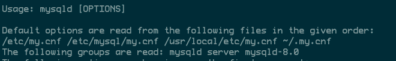

## 连接 MySQL 数据库

当我们安装好 MySQL 服务器后，就可以使用任何客户端程序（例如 mysql 命令行客户端和 MySQL Workbench）连接到 MySQL 服务器。

命令行不需要安装额外的程序，图形界面的程序更易于使用。我们可以根据自己的实际情况选择使用命令行程序还是图形界面的客户端连接到 MySQL 服务器。


- 使用 mysql 命令行客户端连接到数据库


-   连接 成功后，使用 `SHOW DATABASES`显示当前服务器中的所有数据库 

```mysql
show databases;
```

-   检查配置是否生效

默认情况下：mysql的配置文件应该放在

-   Windows

c:\windows\my.ini

c:\windows\my.cnf

c:\my.ini

c:\my.cnf

d:\dev\mysql-version\my.ini

d:\dev\mysql-version\my.cnf


启动mysqld的时候，指定的--defaults-file参数

```shell
D:\dev\mysql-5.7.41-winx64\bin\mysqld --defaults-file=D:\dev\mysql-5.7.41-winx64\my.ini mysql
```


-   Linux

/etc/my.cnf 

/etc/mysql/my.cnf 

/usr/local/mysql/etc/my.cnf 

~/.my.cnf


启动mysql的时候，指定--defaults-file参数

```shell
bin/mysqld_safe --defaults-file=${CONF_DIR}/my.cnf --log_timestamps=SYSTEM --user=mysql &
```


如果没有指定配置文件的路径,mysqld在启动的时候会按照一下路径查找配置文件:

  

